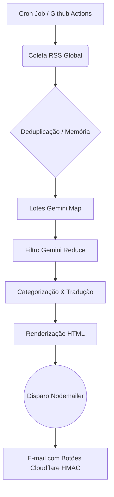

# 🌎 Monitoramento Internacional


Uma aplicação **autônoma** completa que realiza uma varredura diária nos principais jornais de 10 países do mundo, seleciona as notícias mais relevantes usando Inteligência Artificial (Google Gemini), formata resumos bilíngues (Português/Inglês) e envia diretamente para uma lista de e-mails inscritos.

---

## 🚀 Arquitetura e Funcionalidades

O sistema opera de forma totalmente automatizada executando um pipeline robusto todas as madrugadas:

1. **Agregação Global (RSS):** Conecta-se aos feeds RSS das maiores mídias de 10 nações (Brasil, EUA, França, Inglaterra, Espanha, Alemanha, Japão, China, Índia e Portugal).
2. **Janela Temporal e Deduplicação:** Filtra estritamente as notícias publicadas nas últimas 24 horas. O sistema possui memória (`state/news-history.json`) para impedir que uma notícia repetida seja reenviada em dias subsequentes.
3. **Arquitetura Diamante de 2 Passos (Gemini 2.5 Flash):** 
   - **Triagem Rápida (Map):** Divide grandes volumes de matérias em lotes, extraindo e pré-classificando com precisão os candidatos.
   - **Decisão Qualitativa (Reduce):** Filtra cirurgicamente os tópicos finalistas, garantindo alta densidade de informação, aplicando **Categorização Automática** (ex: MERCADO, CIÊNCIA, TECNOLOGIA).
4. **Localização Bilíngue:** Após gerar os resumos e as tags em português, um segundo agente de IA espelha todo o conteúdo perfeitamente para o inglês nativo (EN-US).
5. **Composição Visual Dinâmica:** Gera um e-mail HTML "State of the Art", organizado com "Table of Contents" (índice âncora), estruturado por país (com suporte automático às bandeiras locais) e tags de categorias.
6. **Descadastro e Indicações (Cloudflare Worker):** Incorpora botões dinâmicos no rodapé de cada e-mail com links únicos, assinados com criptografia `HMAC-SHA256`. Quando clicados, acionam um Worker Serverless na Cloudflare que **edita autonomamente o arquivo `recipients.txt` via API do GitHub**, removendo o usuário sem intervenção humana.
7. **Servidor Web de Inscrição:** Roda simultaneamente um micro-serviço web (Express) para captura de novos e-mails (Landing Page).

---

## ⚙️ Fluxo de Funcionamento (Pipeline)



---

## 📦 Estrutura do Projeto

- `src/index.ts`: Arquivo central. Inicia o agendamento local (Node-Cron) e dá boot no Servidor Web.
- `src/server.ts`: Camada Express. Serve a página web do formulário para gravar novos inscritos.
- `src/run.ts`: Maestro do Pipeline (Coleta -> Resumo -> Tradução -> Disparo).
- `src/fetchNews.ts` / `src/sources.ts`: Catálogo de mídias globais e motor extrator de RSS.
- `src/history.ts`: Memória da IA, persistida localmente e no Git, para evitar duplicidades de matérias entre dias.
- `src/geminiHelper.ts`: Utilitário central para chamadas à API do Gemini, incorporando resiliência (Exponential Backoff Retries) para mitigar eventuais instabilidades de conexão ("fetch failed").
- `src/summarize.ts` / `src/translate.ts`: Engenharia de Prompt para o Google Gemini.
- `src/email.ts`: Geração de e-mail e injeção do sistema de segurança (HMAC) no rodapé.
- `worker/`: Pasta contendo a infraestrutura Serverless Cloudflare para descadastramento autônomo.

---

## 🛠 Como Instalar e Rodar (Local)

1. **Clone o repositório e instale as dependências:**
   ```bash
   git clone https://github.com/thalesandradepereira/monitoramento-internacional.git
   cd monitoramento-internacional
   npm install
   ```

2. **Configure o Arquivo `.env`:**
   ```bash
   cp .env.example .env
   ```
   *Preencha o arquivo com suas credenciais do Gemini, credenciais SMTP do seu e-mail, url do Worker e a chave de segurança criptográfica `UNSUBSCRIBE_SECRET`.*

3. **Inicie o Servidor:**
   ```bash
   npm start
   ```

4. **Forçar um Disparo de Teste Imediato:**
   ```bash
   npm run once
   ```

---

## ☁️ Deploy Automático (GitHub Actions + Cloudflare)

O projeto é 100% nativo para nuvem, garantindo estabilidade e zero necessidade de servidores ligados.

### 1. Rotina de Envio Diária (GitHub Actions)
Todas as madrugadas, às **04:00 BRT**, o GitHub Actions rodará o arquivo `.github/workflows/monitoramento.yml`, executará as funções de IA e disparará as campanhas, salvando o estado de memória novamente no repositório (`state/news-history.json`). 
**Atenção:** Cadastre suas credenciais no painel `Settings -> Secrets and variables -> Actions` do seu repositório:
- `GEMINI_API_KEY`, `SMTP_USER`, `SMTP_PASS`, `UNSUBSCRIBE_SECRET`.

### 2. Infraestrutura de Cancelamento de Inscrição (Cloudflare Workers)
Para garantir que a base de dados de destinatários (`recipients.txt`) seja higienizada sem intervenção manual e de maneira segura:
```bash
cd worker
npx wrangler deploy
npx wrangler secret put UNSUBSCRIBE_SECRET
npx wrangler secret put GH_PAT_UNSUB
```
*O `GH_PAT_UNSUB` (Personal Access Token) autorizará o Worker a entrar no seu GitHub de maneira autônoma e remover o e-mail solicitado.*

---
*Powered by TAP Ecosystem* 💌
