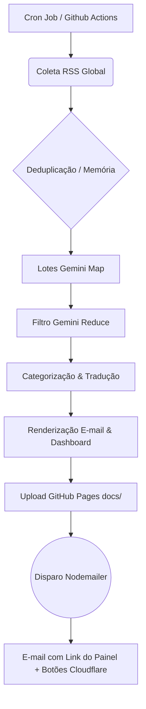

# 🌎 Monitoramento Internacional


Uma aplicação **autônoma** completa que realiza uma varredura diária nos principais jornais de 10 países do mundo, seleciona as notícias mais relevantes usando Inteligência Artificial (Google Gemini), formata resumos bilíngues (Português/Inglês) e envia diretamente para uma lista de e-mails inscritos.

---

## 🚀 Arquitetura e Funcionalidades

O sistema opera de forma totalmente automatizada executando um pipeline robusto todas as madrugadas:

1. **Agregação Global (RSS):** Conecta-se aos feeds RSS das maiores mídias de 10 nações (Brasil, EUA, França, Inglaterra, Espanha, Alemanha, Japão, China, Índia e Portugal).
2. **Janela Temporal e Deduplicação:** Filtra estritamente as notícias publicadas nas últimas 24 horas. O sistema possui memória (`state/news-history.json`) para impedir que uma notícia repetida seja reenviada em dias subsequentes.
3. **Arquitetura Diamante de 2 Passos (Gemini 2.5 Flash):**
   - **Triagem Rápida (Map):** Divide grandes volumes de matérias em lotes, extraindo e pré-classificando com precisão os candidatos.
   - **Decisão Qualitativa (Reduce):** Filtra cirurgicamente os tópicos finalistas, garantindo alta densidade de informação, aplicando **Categorização Automática** (ex: MERCADO, CIÊNCIA, TECNOLOGIA).
4. **Localização Bilíngue:** Após gerar os resumos e as tags em português, um segundo agente de IA espelha todo o conteúdo perfeitamente para o inglês nativo (EN-US).
5. **Composição Visual Dinâmica:** Gera um e-mail HTML "State of the Art", organizado com "Table of Contents" (índice âncora), estruturado por país (com suporte automático às bandeiras locais) e tags de categorias.
6. **Descadastro e Indicações (Cloudflare Worker):** Incorpora botões dinâmicos no rodapé de cada e-mail com links únicos, assinados com criptografia `HMAC-SHA256`. Quando clicados, acionam um Worker Serverless na Cloudflare que **edita autonomamente o arquivo `recipients.txt` via API do GitHub**, removendo o usuário sem intervenção humana.
7. **Servidor Web de Inscrição:** Roda simultaneamente um micro-serviço web (Express) para captura de novos e-mails (Landing Page).
8. **Dashboard Interativo Online (GitHub Pages):** A cada disparo real, o sistema gera e versiona um painel visual estático (`.html`) e o empurra (push) automaticamente para a pasta `docs/` do repositório. O painel é publicado imediatamente de forma gratuita e vitalícia através do GitHub Pages, cujo link de acesso é injetado no topo de cada e-mail.
9. **Segurança operacional:** O workflow possui execução manual segura por padrão (`dry_run=true`), proteção contra concorrência e registro persistente de idempotência diária para evitar reenvios reais na mesma data operacional.

---

## ⚙️ Fluxo de Funcionamento (Pipeline)



---

## 📦 Estrutura do Projeto

- `src/index.ts`: Arquivo central. Inicia o agendamento local (Node-Cron) e dá boot no Servidor Web.
- `src/server.ts`: Camada Express. Serve a página web do formulário para gravar novos inscritos.
- `src/run.ts`: Maestro do Pipeline (Coleta -> Resumo -> Tradução -> Dashboard -> Disparo), respeitando `DRY_RUN` e a idempotência diária antes de qualquer ação externa irreversível.
- `src/fetchNews.ts` / `src/sources.ts`: Catálogo de mídias globais e motor extrator de RSS.
- `src/history.ts`: Memória da IA, persistida localmente e no Git, para evitar duplicidades de matérias entre dias.
- `src/dailyExecution.ts`: Controle operacional de idempotência diária, sincronização do registro persistente e bloqueio de segunda execução real para a mesma data.
- `src/geminiHelper.ts`: Utilitário central para chamadas à API do Gemini, incorporando resiliência (Exponential Backoff Retries) para mitigar eventuais instabilidades de conexão ("fetch failed").
- `src/summarize.ts` / `src/translate.ts`: Engenharia de Prompt para o Google Gemini.
- `src/email.ts`: Geração de e-mail, injeção do sistema de segurança (HMAC) no rodapé e relatório agregado de tentativas/sucessos/falhas sem expor destinatários completos em logs.
- `state/daily-executions.json`: Registro persistente de execuções reais diárias, sem dados pessoais, usado para idempotência operacional.
- `worker/`: Pasta contendo a infraestrutura Serverless Cloudflare para descadastramento autônomo.

---

## 🛠 Como Instalar e Rodar (Local)

1. **Clone o repositório e instale as dependências:**
   ```bash
   git clone https://github.com/thalesandradepereira/monitoramento-internacional.git
   cd monitoramento-internacional
   npm install
   ```

2. **Configure o Arquivo `.env`:**
   ```bash
   cp .env.example .env
   ```
   *Preencha o arquivo com suas credenciais do Gemini, credenciais SMTP do seu e-mail, url do Worker e a chave de segurança criptográfica `UNSUBSCRIBE_SECRET`.*

3. **Inicie o Servidor:**
   ```bash
   npm start
   ```

4. **Forçar uma execução local segura (dry run):**
   ```bash
   DRY_RUN=true EXECUTION_MODE=manual npm run once
   ```
   Esse comando testa coleta, geração e validação em memória sem enviar e-mails, sem publicar dashboard e sem registrar a data como envio concluído.

5. **Executar o pipeline real localmente (uso restrito):**
   ```bash
   DRY_RUN=false EXECUTION_MODE=manual npm run once
   ```
   Use apenas quando houver intenção explícita de envio real e as credenciais estiverem configuradas. Em produção, prefira o GitHub Actions para manter sincronização e idempotência persistente no repositório.

---

## ☁️ Deploy Automático (GitHub Actions + Cloudflare)

O projeto é 100% nativo para nuvem, garantindo estabilidade e zero necessidade de servidores ligados.

### 1. Rotina de Envio Diária (GitHub Actions)

Todas as madrugadas, às **02:00 no horário de Brasília** (`America/Sao_Paulo`), o GitHub Actions roda o arquivo `.github/workflows/monitoramento.yml`, executa as funções de IA e dispara a campanha. Como o `schedule` do GitHub Actions usa UTC, o workflow está configurado como `0 5 * * *`: **05:00 UTC corresponde a 02:00 em Brasília**.

A aplicação Node também pode usar cron local via `CRON_EXPR` + `TIMEZONE`. Nesse caso, o cron é interpretado pelo `node-cron` com `TIMEZONE=America/Sao_Paulo`, portanto o valor correto para 02:00 em Brasília é `CRON_EXPR=0 2 * * *`. Em resumo: **GitHub Actions = `0 5 * * *` em UTC; aplicação local = `0 2 * * *` em `America/Sao_Paulo`**.

| Tipo de execução | Como inicia | `DRY_RUN` efetivo | Pode enviar e-mails? | Pode publicar dashboard? | Registra envio concluído? |
| --- | --- | --- | --- | --- | --- |
| Agendada | `schedule` diário do GitHub (`0 5 * * *` em UTC) | `false` | Sim | Sim | Sim |
| Manual padrão | `workflow_dispatch` sem alterar opções | `true` | Não | Não | Não |
| Manual real | `workflow_dispatch` com `dry_run=false` escolhido explicitamente | `false` | Sim | Sim | Sim, se passar pela idempotência |

O workflow possui `concurrency` com grupo estável (`monitoramento-internacional-diario`) e `cancel-in-progress: false`, impedindo execuções simultâneas sem cancelar uma execução já iniciada. Essa proteção atua no nível do GitHub Actions; a idempotência persistente atua no nível da data operacional para evitar reenvio real no mesmo dia.

**Atenção:** cadastre suas credenciais no painel `Settings -> Secrets and variables -> Actions` do repositório:
- `GEMINI_API_KEY`, `SMTP_USER`, `SMTP_PASS`, `UNSUBSCRIBE_SECRET`.

### Execução manual segura (`dry_run`)

Para testar manualmente pelo GitHub Actions, mantenha `dry_run=true` (padrão). Esse modo informa claramente `DRY RUN` nos logs e pode executar as etapas reversíveis do pipeline: coleta de dados, geração do conteúdo, tradução, renderização do dashboard em memória e validações.

Quando `dry_run=true`, o sistema **não**:
- envia e-mails;
- publica ou altera o dashboard em `docs/`;
- atualiza o histórico de notícias enviadas;
- registra a data como envio concluído;
- executa outra ação externa irreversível.

Para um disparo real manual, o operador precisa alterar explicitamente `dry_run` para `false` antes de iniciar o workflow.

### Idempotência diária persistente

A idempotência diária real é registrada em `state/daily-executions.json`. Esse arquivo JSON não contém e-mails, senhas, tokens ou dados pessoais. Cada registro informa:

- `date`: data operacional no formato `YYYY-MM-DD`, calculada com `TIMEZONE` (padrão `America/Sao_Paulo`);
- `time`: horário da gravação do registro;
- `timezone`: fuso utilizado no cálculo;
- `state`: `in_progress`, `completed`, `failed` ou `dry_run`;
- `mode`: `scheduled`, `manual` ou `local`;
- `attempted`: quantidade de envios tentados;
- `sent`: quantidade enviada com sucesso;
- `failed`: quantidade com erro.

Antes de qualquer envio real, o workflow sincroniza o repositório, lê esse registro persistente e bloqueia uma segunda execução real para a mesma data operacional. Se a sincronização ou a persistência necessária falhar, a execução falha explicitamente e não continua em estado incerto.

Além disso, um disparo real bem-sucedido atualiza o dashboard em `docs/`, envia os e-mails e salva o estado de memória novamente no repositório (`state/news-history.json`).

### 2. Infraestrutura de Cancelamento de Inscrição (Cloudflare Workers)
Para garantir que a base de dados de destinatários (`recipients.txt`) seja higienizada sem intervenção manual e de maneira segura:
```bash
cd worker
npx wrangler deploy
npx wrangler secret put UNSUBSCRIBE_SECRET
npx wrangler secret put GH_PAT_UNSUB
```
*O `GH_PAT_UNSUB` (Personal Access Token) autorizará o Worker a entrar no seu GitHub de maneira autônoma e remover o e-mail solicitado.*


## ✅ Checklist operacional antes de um envio real manual

Antes de alterar `dry_run` para `false` em uma execução manual, confirme:

- o envio real é intencional;
- a execução agendada do dia ainda não registrou `completed` ou outro estado real em `state/daily-executions.json`;
- as credenciais estão cadastradas como Secrets do GitHub Actions, nunca no repositório;
- o arquivo `recipients.txt` não deve ser exibido em logs, PRs ou artefatos;
- não há outro workflow do monitoramento em andamento.

## 🧪 Validações recomendadas para manutenção

Para alterações futuras no projeto, rode pelo menos:

```bash
npm ci
npx tsc --noEmit
ruby -e "require 'yaml'; YAML.load_file('.github/workflows/monitoramento.yml'); puts 'ok'"
npm test
git diff --check
```

Esses comandos validam dependências, tipos TypeScript, sintaxe do workflow e problemas comuns de diff sem executar o monitoramento completo.

---
*Powered by TAP Ecosystem* 💌
