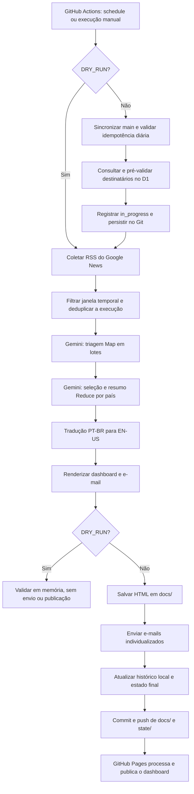

# 🌎 Monitoramento Mídia Internacional | Global Media Monitoring


Pipeline automatizado que coleta notícias internacionais, seleciona e resume os temas mais relevantes com IA, produz conteúdo em português e inglês, gera um dashboard HTML interativo e envia e-mails individualizados aos destinatários ativos armazenados no Cloudflare D1.

## Estado operacional

| Item | Configuração atual |
| --- | --- |
| Identidade | **Monitoramento Mídia Internacional \| Global Media Monitoring** |
| Execução agendada | Diariamente às **02:00 em Brasília** (`05:00 UTC`) |
| Execução manual | `dry_run=true` por padrão |
| Fonte editorial | Pesquisas RSS localizadas do Google News |
| Cobertura | 10 países, janela padrão de 24 horas |
| Processamento de IA | Triagem em lotes, seleção por país, resumo PT-BR e tradução EN-US |
| Destinatários de produção | Cloudflare D1, consultado por endpoint privado autenticado |
| Dashboard | Arquivos HTML versionados em `docs/` e publicados pelo GitHub Pages |
| Envio | SMTP com mensagem individual por destinatário |
| CI | Testes e validações estáticas em pull requests e execução manual |

> O repositório é público. Os dashboards publicados em GitHub Pages também são públicos. Os endereços dos destinatários não devem ser armazenados em arquivos, commits, logs ou artefatos públicos.

## Fluxo real de produção



### Comportamento fail-closed

Uma execução real é interrompida antes da coleta quando a lista privada de destinatários não pode ser carregada ou validada. O pipeline não usa `recipients.txt`, `DEST_EMAIL` ou outra fonte como fallback automático quando `RECIPIENTS_SOURCE=d1` está selecionado.

## Cobertura editorial

As fontes configuradas em `src/sources.ts` são pesquisas RSS do Google News adaptadas ao idioma e à região de cada país:

- Brasil
- Estados Unidos
- França
- Inglaterra
- Espanha
- Alemanha
- Japão
- China
- Índia
- Portugal

As consultas de origem cobrem economia, ciência, tecnologia, esportes, conflitos e política. Na etapa de IA, a seleção editorial prioriza tecnologia, ciência e assuntos em alta.

> O projeto não mantém integrações diretas ou contratos com veículos específicos. A disponibilidade e o conteúdo dependem dos feeds de pesquisa do Google News e das fontes indexadas por ele.

## Processamento de notícias

1. **Coleta concorrente:** lê os 10 feeds com timeout individual.
2. **Janela temporal:** elimina itens fora de `JANELA_HORAS`, cujo padrão é 24 horas.
3. **Deduplicação da execução:** normaliza títulos e remove repetições encontradas no mesmo ciclo.
4. **Decodificação de links:** tenta converter URLs intermediárias do Google News em links diretos, com concorrência limitada.
5. **Triagem Map:** envia lotes de até 200 itens ao Gemini para identificar candidatos por país.
6. **Reduce por país:** escolhe até 8 notícias por país, traduz os títulos para PT-BR, gera resumos e categorias.
7. **Tradução:** cria a versão equivalente em inglês.
8. **Renderização:** produz e-mail e dashboard bilíngues.

O modelo utilizado pelo pipeline é obtido de `config.gemini.model` em `src/config.ts`.

## Saídas geradas

### Dashboard interativo

Cada execução real com notícias cria:

```text
Dashboard-Monitoramento-DD-MM-AAAA.html
```

O dashboard contém:

- identidade **Monitoramento Mídia Internacional | Global Media Monitoring**;
- data operacional;
- busca por palavra-chave;
- seleção de idioma;
- filtros por país e categoria;
- cartões com título, resumo, fonte e link original.

Os arquivos ficam em `docs/` e são acessados pelo GitHub Pages:

```text
https://thalesandradepereira.github.io/monitoramento-internacional/
```

O script atual do dashboard também faz uma chamada a um contador externo de visitas. Remova esse trecho de `src/dashboard.ts` caso o projeto não deva usar telemetria de terceiros.

### E-mail

O envio é realizado individualmente para cada destinatário. A mensagem contém:

- assunto bilíngue com a data;
- botão para o dashboard;
- bloco completo em português;
- bloco completo em inglês;
- link de indicação;
- link individual de descadastro assinado por HMAC.

Os logs exibem somente endereços mascarados e um relatório agregado de tentativas, sucessos e falhas.

## Arquitetura

| Componente | Responsabilidade |
| --- | --- |
| `src/run.ts` | Orquestra o pipeline, o `dry_run`, a pré-validação de destinatários e a persistência operacional |
| `src/fetchNews.ts` | Coleta RSS, filtra a janela, deduplica e decodifica links |
| `src/summarize.ts` | Executa triagem e seleção qualitativa por país |
| `src/translate.ts` | Produz a versão em inglês |
| `src/dashboard.ts` | Gera o dashboard HTML interativo |
| `src/branding.ts` | Aplica a identidade bilíngue ao dashboard |
| `src/email.ts` | Renderiza e envia mensagens individuais por SMTP |
| `src/recipients.ts` | Carrega e valida destinatários, com produção em D1 |
| `src/dailyExecution.ts` | Controla idempotência diária e commits de estado |
| `worker/index.js` | Worker de inscrição, indicação, descadastro e API privada de destinatários |
| Cloudflare D1 | Armazena os destinatários e seus estados fora do GitHub |
| GitHub Actions | Executa o monitoramento e o CI |
| GitHub Pages | Publica os dashboards estáticos |

## Privacidade e segurança

### Dados públicos e privados

| Informação | Local | Visibilidade |
| --- | --- | --- |
| Código-fonte | GitHub | Pública |
| Dashboards e notícias processadas | GitHub Pages / `docs/` | Pública |
| Registro de execução diária | `state/daily-executions.json` | Público, sem dados pessoais |
| Destinatários ativos | Cloudflare D1 | Privada |
| Tokens, senhas e chaves | GitHub Actions Secrets / Worker Secrets | Privada |
| `recipients.txt` | GitHub | Arquivo público desativado, sem endereços |

### Controles implementados

- `dry_run=true` como padrão da execução manual;
- prevalidation da lista D1 antes de registrar `in_progress`;
- endpoint privado com `Authorization: Bearer`;
- HTTPS obrigatório na consulta de destinatários;
- timeout, validação de status HTTP, `Content-Type` e JSON;
- normalização, deduplicação e limite de destinatários;
- logs com e-mails mascarados;
- `Cache-Control: no-store` nos endpoints administrativos;
- comparação de tokens resistente a diferenças de tempo;
- links de descadastro assinados com HMAC-SHA256;
- `concurrency` no GitHub Actions;
- idempotência persistente por data e fuso horário;
- bloqueio de reenvio automático após estado `completed`, `failed` ou incerto.

## Modos de execução

| Modo | Como inicia | `DRY_RUN` | Envia e-mail | Altera `docs/` | Registra execução real |
| --- | --- | --- | --- | --- | --- |
| Agendado | `schedule` do GitHub Actions | `false` | Sim | Sim | Sim |
| Manual padrão | `workflow_dispatch` | `true` | Não | Não | Não |
| Manual real | `workflow_dispatch` com `dry_run=false` | `false` | Sim | Sim | Sim |
| Local padrão | `npm run once` sem `DRY_RUN=false` | `true` | Não | Não | Não |

O workflow de produção está em `.github/workflows/monitoramento.yml` e usa:

```yaml
schedule:
  - cron: '0 5 * * *'
```

O cron do GitHub Actions é interpretado em UTC. Para a aplicação local, `CRON_EXPR=0 2 * * *` é interpretado com `TIMEZONE=America/Sao_Paulo`.

> O GitHub Actions pode iniciar alguns minutos depois do horário nominal devido à fila da plataforma.

## Idempotência diária

O arquivo `state/daily-executions.json` mantém um único estado efetivo por data operacional e fuso:

- `in_progress`
- `completed`
- `failed`
- `dry_run`

Cada registro contém apenas data, horário, fuso, modo e contagens agregadas. Não contém e-mails, tokens ou senhas.

Antes de uma execução real no GitHub Actions, o pipeline atualiza a `main`, verifica o estado do dia e bloqueia duplicidades. O início e o resultado final são persistidos por commits automáticos.

## Instalação local

### Requisitos

- Git
- Node.js 20 ou 22
- npm
- credencial do Google Gemini para processar conteúdo
- credenciais SMTP para envio real
- acesso ao endpoint privado do D1 para uma execução real com `RECIPIENTS_SOURCE=d1`

### Preparação

```bash
git clone https://github.com/thalesandradepereira/monitoramento-internacional.git
cd monitoramento-internacional
npm ci
cp .env.example .env
```

Nunca envie o arquivo `.env` ao GitHub. Ele já está protegido pelo `.gitignore`.

### Dry run local

```bash
DRY_RUN=true EXECUTION_MODE=manual npm run once
```

O dry run pode coletar notícias, chamar a IA, gerar o dashboard em memória e validar o resultado. Ele não envia e-mails, não publica o dashboard, não atualiza o histórico e não registra a data como concluída.

### Servidor e cron locais

```bash
npm start
```

Esse comando inicia o Express e o `node-cron`. Como `DRY_RUN` é seguro por padrão, uma execução local sem `DRY_RUN=false` não deve enviar e-mails.

> `src/server.ts` ainda grava inscrições no arquivo local `recipients.txt`. Esse servidor é legado e não representa o cadastro de produção, que ocorre no Cloudflare Worker com D1.

### Execução real local

```bash
DRY_RUN=false \
EXECUTION_MODE=local \
RECIPIENTS_SOURCE=d1 \
RECIPIENTS_API_TOKEN='configure-localmente' \
npm run once
```

Use somente em uma operação intencional. Fora do GitHub Actions, os commits e pushes automáticos de estado não são executados; portanto, uma execução real local não é equivalente à rotina oficial de produção.

## Configuração

### Variáveis principais

| Variável | Finalidade | Padrão relevante |
| --- | --- | --- |
| `GEMINI_API_KEY` | Chave da IA | Obrigatória para processar conteúdo |
| `SMTP_HOST` | Servidor SMTP | `smtp.gmail.com` |
| `SMTP_PORT` | Porta SMTP | `465` |
| `SMTP_SECURE` | TLS implícito | Ativo quando igual a `true` |
| `SMTP_USER` | Usuário/remetente SMTP | Sem padrão útil |
| `SMTP_PASS` | Senha ou app password | Sem padrão |
| `FROM_NAME` | Nome do remetente | `Monitoramento Mídia Internacional` |
| `DRY_RUN` | Bloqueia ações irreversíveis | Seguro por padrão; somente `false` envia |
| `EXECUTION_MODE` | `scheduled`, `manual` ou `local` | `local` |
| `CRON_EXPR` | Cron da aplicação local | `0 2 * * *` |
| `TIMEZONE` | Fuso da data operacional | `America/Sao_Paulo` |
| `JANELA_HORAS` | Janela de coleta | `24` |
| `DAILY_EXECUTION_LOG_PATH` | Registro de idempotência | `state/daily-executions.json` |
| `UNSUBSCRIBE_WORKER_URL` | URL base do Worker | Configurar explicitamente |
| `UNSUBSCRIBE_SECRET` | Chave HMAC | Obrigatória para links válidos |
| `RECIPIENTS_SOURCE` | Fonte de destinatários | Produção usa `d1` |
| `RECIPIENTS_API_URL` | Endpoint privado | Worker `/internal/recipients` |
| `RECIPIENTS_API_TOKEN` | Bearer token privado | Obrigatório em produção D1 |
| `RECIPIENTS_API_TIMEOUT_MS` | Timeout da API | `5000` |
| `RECIPIENTS_MAX_RECIPIENTS` | Limite defensivo | `500` |

### Secrets do GitHub Actions

Configure em `Settings → Secrets and variables → Actions`:

| Secret | Uso |
| --- | --- |
| `GEMINI_API_KEY` | Geração e tradução do conteúdo |
| `SMTP_USER` | Autenticação e remetente SMTP |
| `SMTP_PASS` | Senha de aplicativo SMTP |
| `UNSUBSCRIBE_SECRET` | Assinatura HMAC dos links de descadastro |
| `RECIPIENTS_API_TOKEN` | Consulta autenticada dos destinatários no D1 |
| `CLOUDFLARE_API_TOKEN` | Operações administrativas e deploy do Worker, quando necessárias |
| `CLOUDFLARE_ACCOUNT_ID` | Identificação da conta em operações Cloudflare |

`DEST_EMAIL` e `GH_PAT_UNSUB` pertencem ao caminho legado baseado em GitHub. Eles não são a fonte oficial do envio de produção quando D1 está selecionado.

## Cloudflare Worker e D1

A configuração está em `worker/wrangler.toml` e usa:

- Worker: `monitoramento-internacional-unsub`
- binding D1: `DB`
- banco: `monitoramento-internacional-recipients`
- `RECIPIENTS_STORAGE=d1`

### Endpoints

| Método e rota | Acesso | Função |
| --- | --- | --- |
| `GET /` | Público | Health check simples |
| `GET /invite` | Público | Formulário bilíngue de indicação |
| `GET /subscribe?email=...` | Público | Cadastra ou reativa um destinatário no D1 |
| `GET /unsubscribe?email=...&token=...` | Público com HMAC | Descadastra o endereço |
| `GET /internal/recipients` | Bearer token | Retorna somente destinatários ativos |
| `POST /internal/recipients/import` | Bearer token | Importação administrativa limitada |

### Deploy e migrations

```bash
cd worker
npx wrangler d1 migrations apply DB --remote
npx wrangler secret put UNSUBSCRIBE_SECRET
npx wrangler secret put RECIPIENTS_API_TOKEN
npx wrangler deploy
```

Não coloque valores de secrets no código, em arquivos TOML, em commits ou em logs.

## Testes e CI

### Validação local

```bash
npm ci
npm test
npx tsc --noEmit
node --check worker/index.js
ruby -e "require 'yaml'; Dir['.github/workflows/*.{yml,yaml}'].sort.each { |file| YAML.load_file(file); puts \"ok #{file}\" }"
git diff --check
```

A suíte cobre, entre outros pontos:

- configuração e comportamento seguro de `DRY_RUN`;
- idempotência diária;
- carregamento e validação de destinatários;
- API D1 do Worker;
- envio de e-mails com lista pré-validada;
- fluxo principal do pipeline;
- requisitos do workflow de produção.

O CI está em `.github/workflows/ci.yml` e executa testes, typecheck, validação JavaScript do Worker, sintaxe YAML e verificação de whitespace.

## Estrutura do repositório

```text
.github/workflows/     GitHub Actions de produção, CI e verificações administrativas

docs/                  Dashboards publicados pelo GitHub Pages
scripts/               Utilitários administrativos
src/                   Aplicação TypeScript
state/                 Estado persistente de execução
worker/                Cloudflare Worker, configuração e migrations D1
tests/                 Testes do pipeline, Worker e workflows
.env.example           Exemplo de configuração local
recipients.txt         Marcador público desativado, sem destinatários
```

## Limitações e débitos técnicos atuais

Esta seção descreve o comportamento do código atual e evita que a documentação prometa funcionalidades ainda não concluídas:

1. **Histórico de notícias entre execuções:** `state/news-history.json` está no `.gitignore` e não existe na `main`. A deduplicação funciona dentro da execução atual, mas o histórico de títulos não é persistido entre runners efêmeros do GitHub Actions.
2. **Seleção do modelo Gemini:** `GEMINI_MODEL` aparece no workflow e no `.env.example`, porém o código atual define o modelo diretamente em `src/config.ts` e não lê essa variável.
3. **Limite global de tópicos:** `MAX_TOPICOS` existe na configuração, mas não é consumido pela seleção atual. O algoritmo escolhe até 8 itens por país.
4. **Servidor Express legado:** `src/server.ts` grava no `recipients.txt`; o cadastro oficial de produção é o Worker com D1.
5. **Código legado de destinatários GitHub:** o Worker ainda contém funções para manipular `recipients.txt`, embora `RECIPIENTS_STORAGE=d1` seja o modo de produção.
6. **Verificação administrativa com quantidade fixa:** o workflow `verify-recipients-d1.yml` espera uma quantidade configurada no próprio arquivo e deve ser ajustado ou tornado dinâmico quando o cadastro mudar.
7. **Dashboard público e contador externo:** o conteúdo do dashboard é público e o HTML atual chama um serviço externo de contagem de visitas.
8. **Licença:** o repositório não possui um arquivo `LICENSE`; portanto, não há licença de reutilização explicitamente declarada.

## Checklist antes de um envio real manual

- confirmar que o envio é intencional;
- verificar se o dia ainda não possui estado real em `state/daily-executions.json`;
- confirmar que o endpoint D1 responde e contém a lista esperada;
- garantir que não há outra execução em andamento;
- manter `dry_run=true` para qualquer teste;
- nunca imprimir, anexar ou versionar a lista de destinatários;
- revisar o dashboard e as credenciais SMTP;
- executar o CI ou as validações locais.

---

*Powered by TAP Ecosystem* 💌
