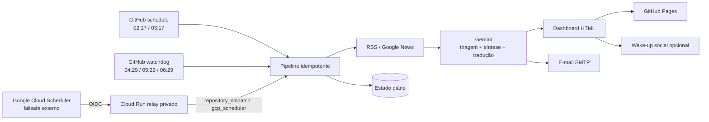
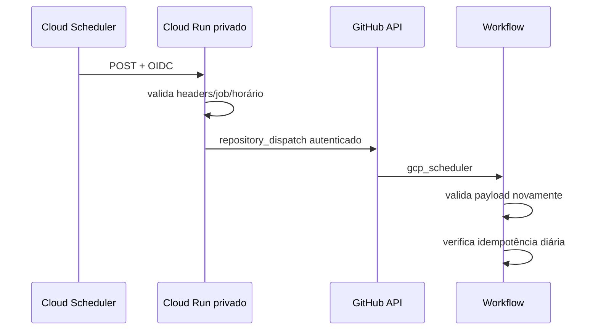
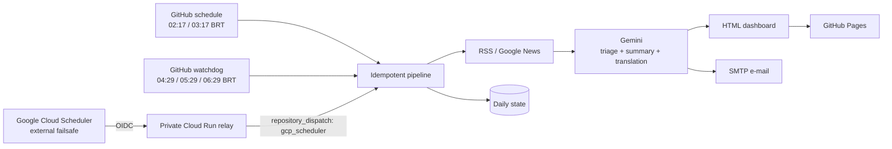

# 🌎 Monitoramento Mídia Internacional | Global Media Monitoring

[](https://github.com/thalesandradepereira/monitoramento-internacional/actions/workflows/ci.yml)


> **Versão / Version:** 1.1.8<br>
> **Fuso operacional / Operational timezone:** `America/Sao_Paulo`<br>
> **Objetivo / Purpose:** monitoramento diário bilíngue, dashboard, e-mail e integração social com múltiplas camadas de contingência.

---

## 🇧🇷 Português do Brasil

### Visão executiva

O **Monitoramento Mídia Internacional** é um pipeline automatizado que coleta notícias internacionais, filtra e deduplica conteúdo, usa Google Gemini para triagem e síntese editorial, produz versões em **PT-BR** e **EN-US**, gera um dashboard HTML diário e envia mensagens individualizadas aos destinatários ativos mantidos fora do GitHub.

O projeto foi desenhado para operar com **fail-closed**, **idempotência diária** e **múltiplos relógios independentes**. Uma execução de contingência pode acontecer várias vezes no mesmo dia sem reenviar conteúdo quando o estado já está concluído.

### Atualização operacional — 04/09/2026

A v1.1.8 registra a validação operacional de produção de 04/09/2026. A edição diária alcançou estado `completed`, o dashboard `Dashboard-Monitoramento-04-09-2026.html` foi persistido, o alias `/hoje` apontou para a mesma data e o Instagram concluiu com `platform_id` não vazio.

O failsafe externo do Google Cloud Scheduler foi comprovado novamente em produção pelo run `33860370126`, evento `repository_dispatch` com modo `gcp-scheduler`. O guard aceitou o target de mídia e, ao chegar ao passo de execução real, encontrou 04/09 já concluído e encerrou explicitamente sem novo envio. O job social subsequente foi ignorado, preservando idempotência e evitando Story duplicado.

Essa evidência confirma operação automática diária, redundância entre relógios e proteção contra duplicidade no cenário observado. Como qualquer arquitetura dependente de serviços externos, a release não afirma disponibilidade matemática absoluta de provedores; ela documenta evidência real de produção e mantém os gates fail-safe existentes.

### Atualização operacional — 03/09/2026

A v1.1.7 fecha o incidente de 03/09/2026, no qual a síntese editorial com `gemini-3.6-flash` atingiu a quota definitiva da Gemini API (HTTP 429). O comportamento anterior ainda tentava novas chamadas e, após o timeout do job, podia deixar a execução diária em `in_progress` sem qualquer tentativa de entrega.

O pipeline agora classifica esgotamento definitivo de quota como não retentável, abre um circuit breaker para o modelo editorial e faz fallback controlado para `gemini-3.5-flash-lite`. A idempotência também permite recuperar automaticamente um `in_progress` abandonado somente quando ele tem mais de 45 minutos e registra simultaneamente `attempted=0`, `sent=0` e `failed=0`; qualquer evidência de tentativa ou entrega continua fail-closed.

As duas correções foram desenvolvidas com regressão RED→GREEN. A recuperação de estado teve RED no run `33733637330` e GREEN no run `33733725525`. A validação real de produção ocorreu no run `33733907369`: o estado stale foi reconhecido, o `gemini-3.6-flash` voltou a responder 429, o fallback foi acionado, o dashboard de 03/09 foi gerado e os 7 destinatários foram aceitos pelo SMTP, com `attempted=7`, `sent=7`, `failed=0`. A publicação social também foi concluída e uma execução posterior do Google Cloud Scheduler permaneceu idempotente, sem duplicar efeitos externos.

A lacuna do QA anterior era uma cadeia temporal composta que não estava modelada ponta a ponta: quota definitiva → retries prolongados → timeout abrupto → estado `in_progress` abandonado → recuperação subsequente. A matriz de regressão passa a tratar explicitamente essas condições. O release gate continua exigindo suíte completa, npm audit, TypeScript, Worker, relay GCP, Docker, YAML, artefatos da data, GitHub Pages e publicação social.

### Atualização operacional — 31/08/2026

O Scheduler Chaos QA de 31/08/2026 ampliou o gate de produção para tratar atraso/ausência do scheduler, concorrência, recuperação externa e publicação social como domínios de falha independentes.

Foram identificadas e tratadas duas lacunas adicionais no Monitoramento Mídia: o comando de testes não incluía arquivos `*.test.mjs` diretamente na raiz de `tests/`, o que permitia um teste de chaos existir sem ser executado; e o publicador social validava o dashboard datado, mas não exigia que o alias público `/hoje` já estivesse na mesma edição antes de emitir o dispatch social. A v1.1.6 corrige ambos.

Ao habilitar os testes MJS de raiz, o CI falhou no run `33383501842`, expondo o contrato antigo do dispatcher. Depois da correção do teste e do gate de `/hoje`, a suíte completa passou no run `33383633346`. A validação de release inclui suíte total, TypeScript, npm audit, Worker, relay GCP, Docker, YAML, GitHub Pages com cache-busting e estado social.

O controlador externo permanece idempotente e independente do scheduler do GitHub. A aprovação de QA significa 100% dos cenários determinísticos definidos no chaos matrix, sem afirmar impossibilidade matemática de falha simultânea de provedores externos.

### Atualização operacional — 30/08/2026

O incidente de 30/08/2026 confirmou que eventos `schedule` do GitHub Actions podem sofrer atraso severo: o run agendado `33306554202` só foi criado às 07:28 BRT. A edição já havia sido recuperada de forma idempotente pelo controlador externo no run `33303070482`, concluída às 06:12 BRT com `attempted=6`, `sent=6`, `failed=0`.

A causa raiz foi classificada como indisponibilidade/atraso do relógio externo do GitHub, não como falha do pipeline, Gemini, SMTP ou persistência. O run tardio comprovou a proteção: encontrou 30/08 como `completed` e encerrou sem novo envio.

A postura de produção da v1.1.5 combina GitHub principal, watchdog, Google Cloud Scheduler/Cloud Run e controlador externo de produção. O controlador verifica estado diário, dashboard, `/hoje`, GitHub Pages e Instagram antes de qualquer recuperação, nunca cria novo disparo quando já existe run relevante `queued`/`in_progress` e não se desativa por falha transitória de ferramenta.

O postmortem completo e as evidências estão em `POSTMORTEM-2026-08-30.md`.

### Atualização operacional — 29/08/2026

A confiabilidade foi reforçada após o incidente de 29/08/2026, quando os eventos `schedule` do GitHub não foram criados no horário esperado.

Estado validado:

- o PR #44 foi integrado à `main`, endurecendo a recuperação de push concorrente: somente marcadores reais de `non-fast-forward` / `fetch first` são tratados como concorrência; rejeições genéricas de permissão não entram em retry;
- o ruleset `main-production-safety` está ativo na branch padrão, bloqueando exclusão e force/non-fast-forward push e exigindo histórico linear, sem bypass;
- a integração `dashboard_published` com o repositório privado `monitoramento-social-publisher` foi configurada com `SOCIAL_PUBLISHER_REPOSITORY` + `SOCIAL_PUBLISHER_TOKEN`;
- a permissão cross-repository foi comprovada por probe não-produtivo com retorno HTTP 204, sem envio de e-mail e sem publicação de Story;
- o relay Google Cloud foi endurecido para provisionamento idempotente, validação prévia de credenciais e limpeza de versões antigas do Secret Manager;
- a camada Google Cloud está **ACTIVE / production validated**: os dois jobs foram provisionados em `tap-monitoramento-auto`, o relay Cloud Run privado respondeu aos dois targets e os dois repositórios receberam `repository_dispatch: gcp_scheduler` reais; a idempotência foi comprovada sem duplicar e-mails nem Story.


### Acessos rápidos

| Recurso | Endereço |
|---|---|
| Dashboard de hoje | https://thalesandradepereira.github.io/monitoramento-internacional/hoje |
| Arquivo histórico | https://thalesandradepereira.github.io/monitoramento-internacional/ |
| Analytics operacional | https://thalesandradepereira.github.io/monitoramento-internacional/analytics.html |
| Workflow principal | `.github/workflows/monitoramento.yml` |
| Watchdog GitHub | `.github/workflows/monitoramento-watchdog.yml` |
| Relay Google Cloud | `infra/gcp-scheduler-relay/` |
| Estado diário | `state/daily-executions.json` |

### Arquitetura de produção


```mermaid
flowchart LR
    GH1[GitHub schedule<br/>02:17 / 03:17] --> PIPE
    GH2[GitHub watchdog<br/>04:29 / 05:29 / 06:29] --> PIPE
    GCS[Google Cloud Scheduler<br/>failsafe externo] -->|OIDC| CR[Cloud Run relay privado]
    CR -->|repository_dispatch: gcp_scheduler| PIPE[Pipeline idempotente]
    PIPE --> RSS[RSS / Google News]
    RSS --> AI[Gemini<br/>triagem + síntese + tradução]
    AI --> DASH[Dashboard HTML]
    AI --> MAIL[E-mail SMTP]
    DASH --> PAGES[GitHub Pages]
    PIPE --> STATE[(Estado diário)]
    DASH --> SOCIAL[Wake-up social opcional]
```

A camada Google Cloud foi desenhada para retirar do GitHub o papel de **único relógio**. O Cloud Scheduler não executa o processamento diretamente: ele chama um **Cloud Run relay privado**, autenticado por OIDC, que dispara um `repository_dispatch` validado no GitHub. O pipeline continua responsável por idempotência, segurança e efeitos externos.

### Camadas de agendamento

| Camada | Horários em Brasília | Função |
|---|---:|---|
| GitHub principal | 02:17, 03:17 | execução primária + recuperação |
| Watchdog GitHub independente | 04:29, 05:29, 06:29 | contingência contra perda do workflow principal |
| Google Cloud Scheduler | 06:41, 06:51 | relógio externo depois das contingências GitHub |

> As execuções repetidas são intencionais. O estado diário impede reenvio quando a data já está `completed`.

### Estado da camada Google Cloud

O repositório contém uma implementação pronta para produção:

- relay HTTP mínimo em Node.js 22;
- container Cloud Run privado;
- validação de `X-CloudScheduler`, `X-CloudScheduler-JobName` e `X-CloudScheduler-ScheduleTime`;
- dispatch separado para mídia e publisher;
- autenticação OIDC Scheduler → Cloud Run;
- token GitHub armazenado em Secret Manager;
- provisionamento idempotente em `infra/gcp-scheduler-relay/deploy.sh`;
- probe seguro de `repository_dispatch` nos dois repositórios antes do deploy;
- limpeza de versões antigas do secret para manter apenas a versão corrente ativa;
- testes unitários do relay e dos receptores `gcp_scheduler`.

**Status de ativação:** `ACTIVE / production validated` em 29/08/2026. O projeto `tap-monitoramento-auto` possui os dois Cloud Scheduler jobs ativos, o Cloud Run privado `tap-github-scheduler-relay`, OIDC/IAM, Secret Manager e dispatch validado em produção nos dois repositórios. O teste real de mídia encerrou por idempotência com `sent=6`, `failed=0` e nenhum novo envio; o publisher encerrou com `ready=false / existing_state_completed`, mantendo `instagram.attempts=1`.

O script agora exige `GCP_PROJECT_ID` explícito para impedir deploy acidental no projeto errado. A credencial GitHub dedicada ao relay deve selecionar somente `monitoramento-internacional` e `monitoramento-social-publisher`, com permissão `Contents: Read and write`. Nenhuma credencial é armazenada no repositório.

### Fluxo diário

1. Um dos relógios inicia o workflow.
2. O pipeline sincroniza `main` e verifica o estado persistido.
3. Se o dia já estiver concluído, encerra sem efeitos externos.
4. A lista de destinatários é carregada do Cloudflare D1 por endpoint privado.
5. O sistema registra `in_progress` antes dos efeitos irreversíveis.
6. RSS é coletado, filtrado por janela temporal e deduplicado.
7. Gemini executa triagem, síntese e tradução.
8. O dashboard e os e-mails são renderizados.
9. Em execução real, o dashboard é persistido em `docs/` e os e-mails são enviados.
10. O estado final é gravado e versionado.
11. GitHub Pages publica o dashboard e atualiza `/hoje`.
12. A integração social pode emitir um wake-up opcional para o publisher.

### IA e cobertura editorial

A cobertura padrão inclui Brasil, Estados Unidos, França, Reino Unido, Espanha, Alemanha, Japão, China, Índia e Portugal. As fontes são pesquisas RSS localizadas do Google News e podem variar conforme disponibilidade e indexação.

| Etapa | Modelo padrão | Papel |
|---|---|---|
| Triagem | `gemini-3.5-flash-lite` | seleção em volume |
| Síntese | `gemini-3.6-flash` | decisão editorial por país |
| Tradução | `gemini-3.5-flash-lite` | equivalência EN-US |

As chamadas usam JSON estruturado, validação local por schema, `store=false`, pacing preventivo e retentativas somente para falhas transitórias.

### Dashboard e GitHub Pages

Cada execução real bem-sucedida cria:

```text
docs/Dashboard-Monitoramento-DD-MM-AAAA.html
```

O alias `docs/hoje/index.html` aponta para a edição corrente, com cache desabilitado. O HTML usa CSP com nonce, serialização segura e validações para links externos.

### Destinatários e privacidade

Os destinatários de produção ficam no **Cloudflare D1**, não no GitHub. O endpoint privado exige Bearer token e o pipeline é fail-closed: se a fonte D1 não puder ser carregada ou validada, a execução real para antes do envio.

Controles principais:

- e-mails mascarados em logs;
- descadastro assinado por HMAC;
- secrets somente em GitHub Actions / Worker / Google Secret Manager;
- sem fallback automático para arquivo público de destinatários;
- `dry_run=true` por padrão em execução manual;
- idempotência por data e fuso;
- `concurrency` compartilhada entre principal e watchdog;
- dispatch externo validado por origem, target, job, horário e frescor.

### Hardening de segurança da v1.1.1

A auditoria final identificou um servidor Express legado que ainda aceitava inscrições e gravava e-mails em `recipients.txt`. Esse caminho foi desativado como fonte de dados: o gateway agora apenas redireciona/delega para o Worker oficial, que persiste destinatários em D1. O fallback do Worker que escrevia PII no GitHub também foi removido, e `recipients.txt` não faz mais parte do HEAD.

Outros reforços:

- D1 é a fonte padrão de destinatários;
- o gateway Express não reflete input do usuário em HTML;
- a CSP do dashboard usa nonce também para estilos, sem `style-src 'unsafe-inline'`;
- o workflow auxiliar de verificação D1 usa Actions fixadas por SHA;
- testes específicos cobrem o comportamento do gateway legado.

**Risco residual conhecido:** o formulário público ainda não implementa double opt-in/Turnstile. Isso é uma melhoria de produto/antiabuso recomendada para uma próxima versão, pois exige fluxo de confirmação e configuração adicional de infraestrutura.

### Concorrência entre Media e Social Publisher — v1.1.3

A versão 1.1.3 corrige uma condição de corrida observada em 28/08/2026: enquanto o pipeline de mídia processava e enviava o relatório, o Social Publisher publicou a imagem do Story no mesmo repositório, avançando a `main`. O push final do dashboard/estado foi então rejeitado como `non-fast-forward`.

O hardening concluído em 29/08/2026 passou a inspecionar também `stderr`/`stdout` do `execSync`, mas só classifica como concorrência os marcadores específicos `non-fast-forward` ou `fetch first`. A frase genérica `failed to push some refs` não é mais suficiente para retry, evitando mascarar bloqueios de branch, autenticação ou hooks.

Quando a rejeição é realmente concorrente, o pipeline executa `git pull --rebase origin main` e repete o push com limite de quatro tentativas. A regressão é coberta por teste dedicado e a CI validou 113/113 testes do projeto, TypeScript, YAML, segurança e o relay GCP.

### Higienização de histórico — v1.1.2

A versão 1.1.2 conclui a higienização do histórico público do Git sem alterar os artefatos publicados em `docs/`.

Controles aplicados:

- histórico da `main` reescrito para remover PII legada de destinatários;
- branches antigas removidas após validação e ausência de PRs abertos;
- releases `v1.0.0`, `v1.1.0` e `v1.1.1` preservadas com tags sanitizadas;
- `recipients.txt` não existe mais na árvore atual nem nas tags reconstruídas;
- os 88 artefatos atuais de `docs/` foram preservados byte a byte;
- a página histórica de 24/08/2026 e o alias `/hoje` foram validados no GitHub Pages;
- os workflows temporários usados na higienização foram removidos após a conclusão.

A limpeza de referências internas/caches mantidos pelo próprio GitHub pode depender de suporte da plataforma e não altera a operação diária do projeto.

### Segurança da camada Google Cloud


```mermaid
sequenceDiagram
    participant S as Cloud Scheduler
    participant R as Cloud Run privado
    participant G as GitHub API
    participant W as Workflow
    S->>R: POST + OIDC
    R->>R: valida headers/job/horário
    R->>G: repository_dispatch autenticado
    G->>W: gcp_scheduler
    W->>W: valida payload novamente
    W->>W: verifica idempotência diária
```

O relay não recebe destinatários, credenciais SMTP, chaves Gemini ou token Instagram. Sua única função é transformar um relógio Google em um evento GitHub autenticado.

### Postura de custo

A arquitetura usa **2 jobs do Cloud Scheduler**, abaixo da franquia atual de **3 jobs sem custo por mês por conta de faturamento**. O relay usa Cloud Run com `min-instances=0`, `max-instances=1` e tráfego de apenas algumas requisições por dia. O provisionamento mantém uma única versão ativa do token no Secret Manager, bem abaixo da franquia atual de 6 versões ativas e 10.000 acessos/mês.

A expectativa para este workload é custo operacional zero enquanto a conta permanecer dentro das franquias gratuitas, mas o uso é agregado por conta de faturamento e preços podem mudar. Referências oficiais: `cloud.google.com/scheduler/pricing`, `cloud.google.com/run/pricing` e `cloud.google.com/secret-manager/pricing`.

### Validação de produção do Google Cloud — 29/08/2026

Evidências finais do teste real:

| Gate | Evidência |
|---|---|
| Media dispatch | GitHub run `33261434000`, evento `repository_dispatch`, conclusão `success` |
| Media guard | `accepted target=media schedule_time=2026-08-29T15:52:38.997Z` |
| Media idempotência | `já registrado como concluído. Encerrando sem novo envio.` |
| E-mails | `attempted=6`, `sent=6`, `failed=0` |
| Publisher dispatch | GitHub run `33260914533`, evento `repository_dispatch`, conclusão `success` |
| Publisher guard | `repository_dispatch/gcp_scheduler` aceito para `2026-08-29` |
| Publisher idempotência | `ready=false`, `reason=existing_state_completed` |
| Instagram | `state=completed`, `attempts=1`, sem Story duplicado |

O relay também foi endurecido para lidar com `gcloud scheduler jobs run`: timestamps nominais futuros dentro de uma janela limitada de 24h são normalizados apenas após OIDC, target e job exatos terem sido validados; timestamps antigos continuam rejeitados e o valor original é preservado para auditoria.

### Operação e diagnóstico

| Verificação | Resultado esperado |
|---|---|
| `state/daily-executions.json` | registro `completed` para a data |
| `docs/Dashboard-Monitoramento-DD-MM-AAAA.html` | arquivo presente |
| `/hoje` | aponta para a data corrente |
| Logs de envio | `failed=0` |
| CI | verde |
| Watchdog | encerra sem duplicar quando o dia já está concluído |
| GCP dispatch | aceito somente se job, target e horário forem válidos |

Em caso de incidente, consulte primeiro o estado persistido antes de reexecutar qualquer rotina real.

### Estrutura do repositório

| Caminho | Responsabilidade |
|---|---|
| `src/run.ts` | orquestração do pipeline |
| `src/fetchNews.ts` | RSS, janela temporal e deduplicação |
| `src/summarize.ts` | triagem e síntese |
| `src/translate.ts` | tradução EN-US |
| `src/geminiHelper.ts` | chamadas Gemini, schema, pacing e retry |
| `src/dashboard.ts` | dashboard HTML |
| `src/todayAlias.ts` | alias seguro `/hoje` |
| `src/email.ts` | e-mail SMTP |
| `src/recipients.ts` | fonte privada de destinatários |
| `src/dailyExecution.ts` | idempotência e estado |
| `scripts/validate-gcp-scheduler-dispatch.mjs` | validação do failsafe externo |
| `infra/gcp-scheduler-relay/` | Cloud Run relay + provisionamento |
| `worker/` | inscrição, descadastro e API D1 |
| `tests/` | testes unitários, integração e regressão |

### Desenvolvimento local

```bash
git clone https://github.com/thalesandradepereira/monitoramento-internacional.git
cd monitoramento-internacional
npm ci
npm test
npx tsc --noEmit
```

Dry run seguro:

```bash
DRY_RUN=true EXECUTION_MODE=manual npm run once
```

### Política de release

O projeto segue SemVer:

- `PATCH`: correção sem nova capacidade;
- `MINOR`: nova capacidade compatível;
- `MAJOR`: mudança incompatível.

A versão 1.1.5 formaliza o fechamento do incidente de 30/08/2026, adiciona o controlador externo à postura operacional documentada e registra o QA pós-incidente com prova real de idempotência.

A versão 1.1.4 consolida as correções do failsafe Google Cloud, a validação real Scheduler → Cloud Run → GitHub, a proteção de Force Run e a prova de idempotência sem duplicidade em produção.

---

## 🇺🇸 English

### Executive overview

**Global Media Monitoring** is an automated pipeline that collects international news, filters and deduplicates content, uses Google Gemini for editorial triage and summarization, produces **PT-BR** and **EN-US** output, generates a daily HTML dashboard, and sends individualized e-mails to active recipients stored outside GitHub.

The system is designed around **fail-closed behavior**, **daily idempotency**, and **multiple independent clocks**. Recovery attempts can run more than once without resending content after the operational date has already reached `completed`.

### Operational update — 2026-09-04

Version 1.1.8 records the 2026-09-04 production validation. The daily edition reached `completed`, `Dashboard-Monitoramento-04-09-2026.html` was persisted, the public `/hoje` alias pointed to the same date, and Instagram completed with a non-empty `platform_id`.

The external Google Cloud Scheduler failsafe was proven again in production by run `33860370126`, a `repository_dispatch` execution in `gcp-scheduler` mode. The guard accepted the media target and the real execution step found September 4 already completed, then exited explicitly without another delivery. The downstream social job was skipped, preserving idempotency and avoiding a duplicate Story.

This evidence confirms daily automatic operation, independent-clock redundancy, and duplicate protection for the observed production scenario. As with any architecture that depends on external providers, the release does not claim mathematical provider availability; it documents live production evidence while preserving the existing fail-safe gates.

### Operational update — 2026-09-03

Version 1.1.7 closes the 2026-09-03 incident in which editorial summarization with `gemini-3.6-flash` exhausted a definitive Gemini API quota (HTTP 429). The previous behavior could keep attempting calls and, after the job timeout, leave the daily execution as `in_progress` without any delivery attempt.

The pipeline now classifies definitive quota exhaustion as non-retryable, opens a circuit breaker for the editorial model, and performs a controlled fallback to `gemini-3.5-flash-lite`. Idempotency also permits automatic recovery of an abandoned `in_progress` record only when it is older than 45 minutes and simultaneously records `attempted=0`, `sent=0`, and `failed=0`; any evidence of an attempted or successful delivery remains fail-closed.

Both fixes were developed with RED→GREEN regression evidence. State recovery was RED in run `33733637330` and GREEN in run `33733725525`. Real production validation occurred in run `33733907369`: the stale state was recognized, `gemini-3.6-flash` returned 429 again, fallback was activated, the September 3 dashboard was generated, and all 7 recipients were accepted by SMTP with `attempted=7`, `sent=7`, `failed=0`. Social publication also completed, and a later Google Cloud Scheduler execution remained idempotent without duplicating external effects.

The previous QA gap was an end-to-end temporal chain that had not been modeled as one scenario: definitive quota exhaustion → prolonged retries → abrupt timeout → abandoned `in_progress` state → subsequent recovery. Regression coverage now explicitly addresses these conditions. The release gate continues to require the complete suite, npm audit, TypeScript, Worker, GCP relay, Docker, YAML, current-day artifacts, GitHub Pages, and social publication.

### Operational update — 2026-08-31

The 2026-08-31 Scheduler Chaos QA expanded the production gate to treat scheduler delay/absence, concurrency, external recovery, and social publication as independent failure domains.

Two additional Media Monitoring gaps were found and fixed: the test command did not include root-level `tests/*.test.mjs` files, allowing a chaos test to exist without being executed; and the social dispatcher validated the dated dashboard but did not require the public `/hoje` alias to point to the same edition before dispatching social publication. Version 1.1.6 closes both gaps.

Once root MJS tests were enabled, CI failed in run `33383501842`, exposing the stale dispatcher contract. After correcting the test contract and the `/hoje` gate, the complete suite passed in run `33383633346`. The full release gate covers the complete suite, TypeScript, npm audit, Worker, GCP relay, Docker, YAML, cache-busted GitHub Pages, and social state.

QA approval means 100% of the deterministic scenarios defined in the chaos matrix passed; it does not claim mathematical impossibility of simultaneous external-provider failure.

### Operational update — 2026-08-30

The 2026-08-30 incident confirmed that GitHub Actions `schedule` events can be severely delayed: scheduled run `33306554202` was only created at 07:28 BRT. The daily edition had already been recovered idempotently by the external production controller through run `33303070482`, completing at 06:12 BRT with `attempted=6`, `sent=6`, `failed=0`.

Root cause was classified as delay/unavailability of GitHub's external scheduling clock, not a pipeline, Gemini, SMTP, or persistence failure. The late scheduled run proved the guard by finding 2026-08-30 already `completed` and exiting without another delivery.

The v1.1.5 production posture combines the primary GitHub workflow, independent watchdog, Google Cloud Scheduler/Cloud Run, and the external production controller. The controller validates daily state, dashboard, `/hoje`, GitHub Pages, and Instagram before any recovery; it never creates another trigger while a relevant run is `queued`/`in_progress`, and it is not disabled by transient tool failures.

The full postmortem and evidence are documented in `POSTMORTEM-2026-08-30.md`.

### Operational update — 2026-08-29

Reliability was strengthened after the 2026-08-29 incident in which expected GitHub `schedule` events were not created on time.

Validated state:

- PR #44 was merged into `main`; concurrent-push recovery now retries only real `non-fast-forward` / `fetch first` conflicts;
- the `main-production-safety` ruleset is active on the default branch, blocking deletion and force/non-fast-forward pushes and requiring linear history with no bypass;
- the `dashboard_published` integration to the private `monitoramento-social-publisher` repository is configured through `SOCIAL_PUBLISHER_REPOSITORY` and `SOCIAL_PUBLISHER_TOKEN`;
- cross-repository permission was verified with a non-production probe returning HTTP 204, without sending e-mail or publishing an Instagram Story;
- Google Cloud provisioning is hardened and idempotent, including preflight permission checks and Secret Manager version cleanup;
- the Google Cloud layer is **ACTIVE / production validated**: both Scheduler jobs are provisioned in `tap-monitoramento-auto`, the private Cloud Run relay reached both GitHub repositories through real `repository_dispatch: gcp_scheduler` events, and idempotency prevented duplicate e-mail and Instagram effects.


### Quick links

| Resource | Address |
|---|---|
| Today's dashboard | https://thalesandradepereira.github.io/monitoramento-internacional/hoje |
| Dashboard archive | https://thalesandradepereira.github.io/monitoramento-internacional/ |
| Operational analytics | https://thalesandradepereira.github.io/monitoramento-internacional/analytics.html |
| Main workflow | `.github/workflows/monitoramento.yml` |
| GitHub watchdog | `.github/workflows/monitoramento-watchdog.yml` |
| Google Cloud relay | `infra/gcp-scheduler-relay/` |
| Daily state | `state/daily-executions.json` |

### Production architecture


```mermaid
flowchart LR
    GH1[GitHub schedule<br/>02:17 / 03:17 BRT] --> PIPE
    GH2[GitHub watchdog<br/>04:29 / 05:29 / 06:29 BRT] --> PIPE
    GCS[Google Cloud Scheduler<br/>external failsafe] -->|OIDC| CR[Private Cloud Run relay]
    CR -->|repository_dispatch: gcp_scheduler| PIPE[Idempotent pipeline]
    PIPE --> RSS[RSS / Google News]
    RSS --> AI[Gemini<br/>triage + summary + translation]
    AI --> DASH[HTML dashboard]
    AI --> MAIL[SMTP e-mail]
    DASH --> PAGES[GitHub Pages]
    PIPE --> STATE[(Daily state)]
```

The Google Cloud layer removes GitHub as the **single scheduling clock**. Cloud Scheduler calls a private Cloud Run relay authenticated with OIDC, and the relay sends a validated GitHub `repository_dispatch`. This path was production-validated on 2026-08-29 for both media and publisher targets.

### Scheduling layers

| Layer | Brasília time | Purpose |
|---|---:|---|
| Primary GitHub workflow | 02:17, 03:17 | primary execution and recovery |
| Independent GitHub watchdog | 04:29, 05:29, 06:29 | recovery from a missed primary schedule |
| Google Cloud Scheduler | 06:41, 06:51 | external clock after GitHub fallbacks |

Duplicate wake-ups are safe because the application checks persistent daily state before producing side effects.

### Google Cloud layer

The repository includes a production-ready implementation:

- a minimal Node.js 22 HTTP relay;
- a private Cloud Run container;
- Scheduler header, job-name and freshness validation;
- separate media and publisher targets;
- OIDC Scheduler → Cloud Run authentication;
- Secret Manager integration for the GitHub dispatch credential;
- idempotent provisioning in `infra/gcp-scheduler-relay/deploy.sh`;
- safe non-production dispatch probes against both repositories before deployment;
- cleanup of superseded enabled secret versions;
- unit tests for the relay and both GitHub receivers.

**Activation status:** `ACTIVE / production validated` as of 2026-08-29. Both Scheduler jobs are active in `tap-monitoramento-auto`; the private Cloud Run relay, OIDC/IAM, Secret Manager, and both GitHub receivers were validated with live dispatches. Media idempotency preserved `sent=6`, `failed=0`; publisher idempotency preserved `instagram.attempts=1`.

The deployment script requires an explicit `GCP_PROJECT_ID` to prevent accidental deployment to the wrong project. The dedicated fine-grained GitHub token must select only the two production repositories and grant `Contents: Read and write`. Credentials must never be committed to this repository.

### v1.1.1 security hardening

The final audit found a legacy Express subscription server that could still accept addresses and write them to `recipients.txt`. That path is no longer an authoritative data store: the gateway now redirects/delegates to the official Worker, which persists recipients in D1. The Worker fallback that could write recipient PII through the GitHub API was removed, and `recipients.txt` is no longer present in HEAD.

Additional hardening:

- D1 is the default recipient source;
- the Express gateway no longer reflects user input into HTML;
- dashboard CSP uses a nonce for styles and no longer allows `style-src 'unsafe-inline'`;
- the auxiliary D1 verification workflow uses immutable Action SHAs;
- dedicated tests cover the legacy gateway behavior.

**Known residual risk:** the public subscription form does not yet implement double opt-in/Turnstile. That is recommended as a future anti-abuse/product enhancement because it requires a confirmation flow and additional infrastructure configuration.

### History sanitization — v1.1.2

Version 1.1.2 completes the public Git history sanitization without changing the published `docs/` artifacts.

Controls applied:

- the public `main` history was rewritten to remove legacy recipient PII;
- stale branches were removed after validation and confirmation that no pull requests were open;
- releases `v1.0.0`, `v1.1.0`, and `v1.1.1` remain available through sanitized tags;
- `recipients.txt` is absent from the current tree and reconstructed release tags;
- all 88 current `docs/` artifacts were preserved byte-for-byte;
- the 24/08/2026 historical page and `/hoje` were validated through GitHub Pages;
- one-time sanitization workflows were removed after completion.

Server-managed pull-request refs/caches may still require GitHub Support for complete dereferencing; this does not affect the daily production pipeline.

### Reliability and security

The 2026-08-29 hardening also corrected concurrent push classification. The persistence layer inspects `message`, `stderr`, and `stdout`, but retries only on specific `non-fast-forward` or `fetch first` markers. Generic `failed to push some refs` output is not enough to trigger a rebase/retry, so branch protection, authentication, and hook failures remain visible.

The production pipeline:

- synchronizes `main` before a real run;
- persists `in_progress` before irreversible effects;
- blocks duplicates by operational date and timezone;
- fails closed when private recipient data cannot be validated;
- masks recipient addresses in logs;
- validates external dispatch source, target, job name, schedule time and freshness;
- uses GitHub Actions pinned to immutable SHAs;
- runs security audit, tests, TypeScript checks, YAML validation and relay tests in CI.

### Cost posture

The design uses two Cloud Scheduler jobs, below Google's current allowance of three free jobs per billing account per month. Cloud Run uses `min-instances=0`, `max-instances=1`, and only a few short requests per day. Provisioning keeps one active Secret Manager token version, below the current free allowance of six active versions and 10,000 access operations per month.

This workload is expected to stay within the free usage envelope, but quotas are aggregated by billing account and pricing can change. Official references: `cloud.google.com/scheduler/pricing`, `cloud.google.com/run/pricing`, and `cloud.google.com/secret-manager/pricing`.

### Repository map

| Path | Responsibility |
|---|---|
| `src/run.ts` | pipeline orchestration |
| `src/fetchNews.ts` | RSS collection and deduplication |
| `src/summarize.ts` | editorial triage and summaries |
| `src/translate.ts` | EN-US translation |
| `src/geminiHelper.ts` | Gemini API, schemas, pacing and retries |
| `src/dashboard.ts` | HTML dashboard |
| `src/todayAlias.ts` | safe `/hoje` alias |
| `src/email.ts` | SMTP delivery |
| `src/recipients.ts` | private recipient source |
| `src/dailyExecution.ts` | idempotency and state |
| `scripts/validate-gcp-scheduler-dispatch.mjs` | external clock guard |
| `infra/gcp-scheduler-relay/` | Cloud Run relay and provisioning |
| `worker/` | D1 subscription/unsubscribe API |
| `tests/` | unit, integration and regression tests |

### Local development

```bash
git clone https://github.com/thalesandradepereira/monitoramento-internacional.git
cd monitoramento-internacional
npm ci
npm test
npx tsc --noEmit
```

Safe dry run:

```bash
DRY_RUN=true EXECUTION_MODE=manual npm run once
```

### Release policy

This repository follows Semantic Versioning. Version **1.1.5** formalizes closure of the 2026-08-30 incident, documents the external production controller, and records post-incident QA with live idempotency evidence. Version **1.1.4** consolidated the Google Cloud failsafe fixes, live Scheduler → Cloud Run → GitHub validation, bounded Force Run handling, and production idempotency evidence with no duplicate effects.

---

**Made by TAP**
