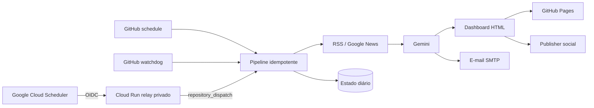

# 🌎 Monitoramento Mídia Internacional | Global Media Monitoring

> **Versão / Version:** 1.1.8 
> **Fuso operacional / Operational timezone:** `America/Sao_Paulo` 
> **Objetivo / Purpose:** monitoramento diário bilíngue, dashboard, e-mail e integração social com múltiplas camadas de contingência.

---

## 🇧🇷 Português do Brasil

### Visão executiva

O **Monitoramento Mídia Internacional** é um pipeline automatizado que coleta notícias internacionais, filtra e deduplica conteúdo, usa Google Gemini para triagem e síntese editorial, produz versões em **PT-BR** e **EN-US**, gera um dashboard HTML diário e envia mensagens individualizadas aos destinatários ativos mantidos fora do GitHub.

O projeto foi desenhado para operar com **fail-closed**, **idempotência diária** e **múltiplos relógios independentes**. Uma execução de contingência pode acontecer várias vezes no mesmo dia sem reenviar conteúdo quando o estado já está concluído.

### Hardening de gatilhos — 05/09/2026

A investigação do incidente recorrente de 05/09/2026 confirmou ausência simultânea de runs `schedule` nos repositórios de mídia e publicação. A falha comum ocorreu antes do pipeline: o GitHub Actions não criou as execuções agendadas observadas naquela janela.

O failsafe externo versionado no Google Cloud Scheduler existia, porém estava limitado a duas oportunidades tardias por alvo. O `deploy.sh` foi corrigido para criar uma malha externa sobreposta à janela de recuperação:

- **Mídia:** 03:11, 03:41, 04:11, 04:41, 05:11, 05:41, 06:11 e 06:41 BRT (`11,41 3-6 * * *`).
- **Publisher:** 03:21, 03:51, 04:21, 04:51, 05:21, 05:51, 06:21 e 06:51 BRT (`21,51 3-6 * * *`).

O publisher fica defasado em 10 minutos. Cada ativação continua protegida pela idempotência diária, validação de target/job/data, OIDC e retry limitado. O teste de regressão foi executado em RED no run `33955666834` e o gate completo passou em GREEN no run `33955788944`, cobrindo suíte completa, `npm audit`, TypeScript, Worker, relay GCP, sintaxe Bash, Docker, YAML e whitespace.

**Importante:** esta alteração atualiza o código de provisionamento. A nova cadência somente está ativa no Google Cloud real depois de reexecutar `infra/gcp-scheduler-relay/deploy.sh` no projeto de produção e confirmar os schedules live. O postmortem detalhado está em `POSTMORTEM-2026-09-05.md`.

### Recuperação operacional — 05/09/2026

O controlador externo pode usar reexecução específica de job como mecanismo auxiliar quando existe um run anterior válido e não há execução ativa. Esse mecanismo não é considerado relógio independente: uma reexecução pode ser aceita pela API e ainda permanecer pendente se o plano de execução do GitHub estiver degradado.

- A reexecução nunca substitui o Google Cloud Scheduler como relógio externo.
- E-mails já concluídos não são reenviados para reparar Pages ou Instagram.
- Falha de leitura, entrega parcial e estado incerto não autorizam tentativa forçada.
- Atrasos do scheduler do GitHub e falhas dos serviços externos continuam possíveis.

### Atualização operacional — 04/09/2026

A v1.1.8 registra a validação operacional de produção de 04/09/2026. A edição diária alcançou estado `completed`, o dashboard `Dashboard-Monitoramento-04-09-2026.html` foi persistido, o alias `/hoje` apontou para a mesma data e o Instagram concluiu com `platform_id` não vazio.

O failsafe externo do Google Cloud Scheduler foi comprovado novamente em produção pelo run `33860370126`, evento `repository_dispatch` com modo `gcp-scheduler`. O guard aceitou o target de mídia e, ao chegar ao passo de execução real, encontrou 04/09 já concluído e encerrou explicitamente sem novo envio. O job social subsequente foi ignorado, preservando idempotência e evitando Story duplicado.

### Atualização operacional — 03/09/2026

A v1.1.7 fecha o incidente de 03/09/2026, no qual a síntese editorial com `gemini-3.6-flash` atingiu a quota definitiva da Gemini API (HTTP 429). O pipeline agora classifica esgotamento definitivo de quota como não retentável, abre um circuit breaker para o modelo editorial e faz fallback controlado para `gemini-3.5-flash-lite`.

### Arquitetura de produção

```mermaid
flowchart LR
    GH1[GitHub schedule] --> PIPE
    GH2[GitHub watchdog] --> PIPE
    GCS[Google Cloud Scheduler] -->|OIDC| CR[Cloud Run relay privado]
    CR -->|repository_dispatch| PIPE[Pipeline idempotente]
    PIPE --> RSS[RSS / Google News]
    RSS --> AI[Gemini]
    AI --> DASH[Dashboard HTML]
    AI --> MAIL[E-mail SMTP]
    DASH --> PAGES[GitHub Pages]
    PIPE --> STATE[(Estado diário)]
    DASH --> SOCIAL[Publisher social]
```

### Camadas de agendamento

| Camada | Horários em Brasília | Função |
|---|---:|---|
| GitHub principal | 02:17, 03:17 | execução primária + recuperação |
| Watchdog GitHub | 04:29, 05:29, 06:29 | contingência dentro do GitHub |
| Google Cloud — mídia | 03:11/03:41 até 06:41 | relógio externo para mídia |
| Google Cloud — publisher | 03:21/03:51 até 06:51 | relógio externo para publicação |

> As execuções repetidas são intencionais. O estado diário impede reenvio quando a data já está `completed`.

### Estado da camada Google Cloud

O repositório contém uma implementação pronta para produção com Cloud Run privado, OIDC, Secret Manager, validação de job/target/data e provisionamento idempotente em `infra/gcp-scheduler-relay/deploy.sh`.

A camada foi validada em produção anteriormente. Após o hardening de 05/09/2026, **o novo código requer redeploy live** para que as janelas ampliadas substituam os schedules anteriores no Google Cloud.

### Operação e diagnóstico

| Verificação | Resultado esperado |
|---|---|
| `state/daily-executions.json` | registro `completed` para a data |
| `docs/Dashboard-Monitoramento-DD-MM-AAAA.html` | arquivo presente |
| `/hoje` | aponta para a data corrente |
| Logs de envio | `failed=0` |
| CI | verde |
| Watchdog | encerra sem duplicar quando o dia já está concluído |
| GCP dispatch | aceito somente se job, target e horário forem válidos |

Em caso de incidente, consulte primeiro o estado persistido antes de reexecutar qualquer rotina real.

---

## 🇺🇸 English

### Executive overview

**Global Media Monitoring** is an automated pipeline that collects international news, filters and deduplicates content, uses Google Gemini for editorial triage and summarization, produces **PT-BR** and **EN-US** output, generates a daily HTML dashboard, and sends individualized e-mails to active recipients stored outside GitHub.

The system is designed around **fail-closed behavior**, **daily idempotency**, and **multiple independent clocks**.

### Trigger hardening — 2026-09-05

The recurring 2026-09-05 incident confirmed simultaneous absence of GitHub Actions `schedule` runs in both media and publisher repositories. The shared failure happened before pipeline execution.

The versioned Google Cloud Scheduler failsafe existed, but provisioning only provided two late opportunities per target. `deploy.sh` now defines an overlapping external recovery mesh:

- **Media:** 03:11, 03:41, 04:11, 04:41, 05:11, 05:41, 06:11 and 06:41 BRT (`11,41 3-6 * * *`).
- **Publisher:** 03:21, 03:51, 04:21, 04:51, 05:21, 05:51, 06:21 and 06:51 BRT (`21,51 3-6 * * *`).

Publisher wake-ups are staggered 10 minutes after media. Each wake-up remains protected by daily idempotency, target/job/date validation, OIDC and bounded retries. Regression evidence: RED run `33955666834`; full GREEN gate `33955788944`.

**Important:** this changes the provisioning code. The new cadence becomes active in the real Google Cloud environment only after `infra/gcp-scheduler-relay/deploy.sh` is redeployed in production and the live schedules are verified. See `POSTMORTEM-2026-09-05.md`.

### Scheduling layers

| Layer | Brasília time | Purpose |
|---|---:|---|
| GitHub primary | 02:17, 03:17 | primary execution + recovery |
| GitHub watchdog | 04:29, 05:29, 06:29 | GitHub-side fallback |
| Google Cloud — media | 03:11/03:41 through 06:41 | independent external clock for media |
| Google Cloud — publisher | 03:21/03:51 through 06:51 | independent external clock for publishing |

Repeated wake-ups are intentional and safe because persistent daily state prevents duplicate external effects after completion.

### Residual risk

The Google Cloud layer removes the GitHub **scheduler** as a single clock. It does not remove GitHub Actions as the execution plane. A complete GitHub Actions outage may still prevent externally dispatched jobs from running. Eliminating that residual dependency would require an independent executor such as Cloud Run Jobs, not only an independent scheduler.

---

**Made by TAP**
