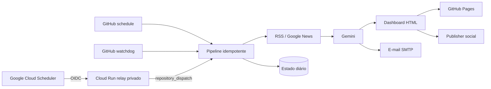

# 🌎 Monitoramento Mídia Internacional | Global Media Monitoring

[](https://github.com/thalesandradepereira/monitoramento-internacional/actions/workflows/ci.yml)


> **Versão / Version:** 1.1.9
>
> **Fuso operacional / Operational timezone:** `America/Sao_Paulo`
>
> **Status de produção / Production status:** Google Cloud trigger mesh **LIVE + E2E validated** em 05/09/2026.
>
> **Objetivo / Purpose:** monitoramento diário bilíngue, dashboard, e-mail e integração social com múltiplas camadas de contingência.

---

## 🇧🇷 Português do Brasil

### Visão executiva

O **Monitoramento Mídia Internacional** coleta notícias internacionais, filtra e deduplica conteúdo, usa Google Gemini para triagem e síntese editorial, produz versões em **PT-BR** e **EN-US**, gera um dashboard HTML diário, envia e-mails individualizados e aciona o publisher social.

A arquitetura opera com três princípios centrais:

- **fail-closed:** estado incerto ou entrega parcial nunca autoriza retry cego;
- **idempotência diária:** uma data já concluída não gera novo e-mail ou nova Story;
- **múltiplos relógios:** GitHub principal, watchdog e Google Cloud Scheduler podem acordar o pipeline de forma redundante.

### Release v1.1.9 — hardening final de produção em 05/09/2026

A investigação do décimo dia consecutivo de incidentes encontrou uma causa comum: durante a janela observada, os repositórios de mídia e publicação não receberam os `schedule` runs esperados do GitHub Actions. A falha ocorreu antes da execução do pipeline.

O failsafe externo do Google Cloud já existia, mas cobria apenas oportunidades tardias. A v1.1.9 consolida a malha externa ampliada e sua validação live:

| Alvo | Cron live | Horários em Brasília |
|---|---|---|
| Mídia | `11,41 3-6 * * *` | 03:11, 03:41, 04:11, 04:41, 05:11, 05:41, 06:11, 06:41 |
| Publisher | `21,51 3-6 * * *` | 03:21, 03:51, 04:21, 04:51, 05:21, 05:51, 06:21, 06:51 |

O publisher fica defasado em 10 minutos. Cada wake-up continua protegido por OIDC, allow-list de job/target, validação de data/frescor, retries limitados e estado autoritativo.

### Incidente de compatibilidade `gcloud` e correção

O primeiro redeploy live de 05/09 atualizou o Cloud Run, mas falhou na atualização dos Scheduler Jobs porque a versão corrente do `gcloud scheduler jobs update http` rejeitou o argumento `--headers=Content-Type=application/json` no caminho de **update**.

A correção foi implementada no PR **#60** e integrada no commit `d580eb95a5f34fd2a49cd46365437fc09b17bc1c`:

- `--headers` permanece no caminho de criação do job;
- o caminho de atualização deixa de passar o argumento incompatível;
- teste de regressão garante que create/update não voltem a divergir incorretamente;
- CI do PR: run `33965307627`, sucesso;
- CI da `main` após merge: run `33965379023`, sucesso.

### Evidência live de produção — 05/09/2026

O redeploy final foi executado no projeto `tap-monitoramento-auto` e concluiu com:

- Cloud Run revision `tap-github-scheduler-relay-00007-24r` servindo 100% do tráfego;
- jobs `tap-monitoramento-media-failsafe` e `tap-instagram-publisher-failsafe` em estado `ENABLED`;
- timezone `America/Sao_Paulo` nos dois jobs;
- OIDC com service account dedicado;
- novos crons persistidos no Cloud Scheduler;
- versões antigas do secret de dispatch removidas, mantendo somente a versão ativa necessária.

#### E2E Mídia

Um `gcloud scheduler jobs run tap-monitoramento-media-failsafe` gerou o GitHub run **`33965818735`** com evento `repository_dispatch` e conclusão `success`.

O guard aceitou `target=media`, recalculou a data operacional como `2026-09-05` e o pipeline encontrou o estado diário já `completed`. Resultado: **encerrou sem novo envio de e-mail** e o job social subsequente foi `skipped`.

O estado autoritativo de 05/09 permanece:

```text
state=completed
mode=scheduled
attempted=7
sent=7
failed=0
```

#### E2E Publisher

O `gcloud scheduler jobs run tap-instagram-publisher-failsafe` gerou no repositório privado o run **`33965937669`**, também `success`.

O publisher aceitou `repository_dispatch/gcp_scheduler`, encontrou `instagram.state=completed` e retornou:

```text
ready=false
reason=existing_state_completed
```

Nenhuma imagem foi gerada e nenhuma chamada à Meta foi iniciada. O estado de 05/09 permaneceu `completed`, com `platform_id=18352903591218220` e sem Story duplicado.

### Arquitetura de produção


```mermaid
flowchart LR
    GH1[GitHub schedule] --> PIPE
    GH2[GitHub watchdog] --> PIPE
    GCS[Google Cloud Scheduler] -->|OIDC| CR[Cloud Run relay privado]
    CR -->|repository_dispatch| PIPE[Pipeline idempotente]
    PIPE --> RSS[RSS / Google News]
    RSS --> AI[Gemini]
    AI --> DASH[Dashboard HTML]
    AI --> MAIL[E-mail SMTP]
    DASH --> PAGES[GitHub Pages]
    PIPE --> STATE[(Estado diário)]
    DASH --> SOCIAL[Publisher social]
```

### Camadas de agendamento

| Camada | Horários em Brasília | Função |
|---|---:|---|
| GitHub principal | 02:17, 03:17 | execução primária + recuperação |
| Watchdog GitHub | 04:29, 05:29, 06:29 | contingência dentro do GitHub |
| Google Cloud — mídia | 03:11/03:41 até 06:41 | relógio externo para mídia |
| Google Cloud — publisher | 03:21/03:51 até 06:51 | relógio externo para publicação |

As ativações redundantes são intencionais. O estado persistido é o gate que impede efeitos externos duplicados.

### Google Cloud Scheduler / Cloud Run

A infraestrutura versionada está em:

```text
infra/gcp-scheduler-relay/
```

Características principais:

1. Cloud Scheduler envia POST autenticado por OIDC.
2. Cloud Run permanece privado e aceita somente o invoker autorizado.
3. O relay valida job, target, data e frescor.
4. A credencial GitHub fica no Secret Manager.
5. O relay emite `repository_dispatch` para o repositório correto.
6. O workflow valida novamente o evento antes de executar qualquer efeito real.
7. O provisionamento é idempotente: redeploy atualiza recursos existentes.

### Idempotência e recuperação

Antes de qualquer recuperação real:

1. consulte `state/daily-executions.json`;
2. confirme se existe run `queued` ou `in_progress`;
3. valide dashboard datado e `/hoje`;
4. nunca reenvie e-mail para reparar Pages ou Instagram;
5. nunca force retry após entrega parcial ou estado ambíguo;
6. trate re-run de job GitHub como mecanismo auxiliar, não como relógio independente.

### QA e desenvolvimento

```bash
npm ci
npm audit --audit-level=moderate
npm test
npx tsc --noEmit
node --check worker/index.js
node --check infra/gcp-scheduler-relay/src/server.mjs
bash -n infra/gcp-scheduler-relay/deploy.sh
npm --prefix infra/gcp-scheduler-relay test
docker build -t tap-gcp-scheduler-relay:qa infra/gcp-scheduler-relay
```

O gate de release também valida YAML, whitespace, artefatos do dia, GitHub Pages `/hoje`, dashboard datado e estado social `completed` com `platform_id` não vazio.

### Histórico recente

| Versão | Data | Destaque |
|---|---|---|
| v1.1.7 | 03/09/2026 | circuit breaker/fallback Gemini e recuperação conservadora de stale `in_progress` |
| v1.1.8 | 04/09/2026 | validação operacional diária e prova do failsafe externo anterior |
| **v1.1.9** | **05/09/2026** | trigger mesh GCP ampliado, redeploy live, compatibilidade `gcloud` corrigida e E2E idempotente nos dois alvos |

### Risco residual

O Google Cloud Scheduler remove o **scheduler do GitHub** como relógio único, mas o GitHub Actions continua sendo o plano de execução. Uma indisponibilidade completa do GitHub Actions ainda pode impedir que um `repository_dispatch` seja executado. Eliminar também essa dependência exigiria um executor independente, por exemplo Cloud Run Jobs.

---

## 🇺🇸 English

### Executive overview

**Global Media Monitoring** is an automated pipeline that collects and deduplicates international news, uses Google Gemini for editorial triage and summarization, generates **PT-BR** and **EN-US** output, publishes a daily HTML dashboard, sends individualized e-mails, and wakes the private social publisher.

The system is built around **fail-closed behavior**, **daily idempotency**, and **multiple clocks**.

### v1.1.9 — production hardening completed on 2026-09-05

The recurring incident investigation found a shared pre-pipeline failure: expected GitHub Actions `schedule` runs were absent in both media and publisher repositories during the observed window.

The external Google Cloud failsafe has now been expanded and deployed live:

- **Media:** `11,41 3-6 * * *` — 03:11 through 06:41 BRT every 30 minutes.
- **Publisher:** `21,51 3-6 * * *` — 03:21 through 06:51 BRT every 30 minutes.

The publisher is staggered 10 minutes after media. Repeated wake-ups remain safe because persistent state blocks duplicate effects after completion.

### Live evidence

- Cloud Run revision `tap-github-scheduler-relay-00007-24r` deployed and serving traffic.
- Both Scheduler jobs are `ENABLED` in `America/Sao_Paulo` with OIDC.
- Media E2E run `33965818735`: `repository_dispatch`, success, existing completed state detected, **no duplicate e-mail**.
- Publisher E2E run `33965937669`: `repository_dispatch`, success, `ready=false / existing_state_completed`, **no image generation and no Meta publish call**.
- September 5 media state remained `attempted=7`, `sent=7`, `failed=0`.
- September 5 Instagram state remained `completed` with `platform_id=18352903591218220`.

### `gcloud` compatibility fix

The first live redeploy exposed a real compatibility issue: current `gcloud scheduler jobs update http` rejected the `--headers` argument. PR #60 fixed the update path while preserving the header on job creation and added regression coverage. PR CI run `33965307627` and post-merge main CI run `33965379023` both completed successfully.

### Scheduling layers

| Layer | Brasília time | Purpose |
|---|---:|---|
| GitHub primary | 02:17, 03:17 | primary execution + recovery |
| GitHub watchdog | 04:29, 05:29, 06:29 | GitHub-side fallback |
| Google Cloud — media | 03:11/03:41 through 06:41 | external media clock |
| Google Cloud — publisher | 03:21/03:51 through 06:51 | external publisher clock |

### Residual risk

Google Cloud removes GitHub **Scheduler** as the only clock. GitHub Actions is still the execution plane; a full Actions outage can still block externally dispatched work. Removing that residual dependency would require an independent executor such as Cloud Run Jobs.

---

**Made by TAP**
