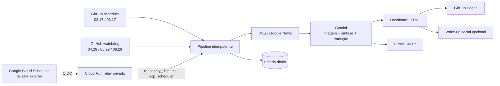
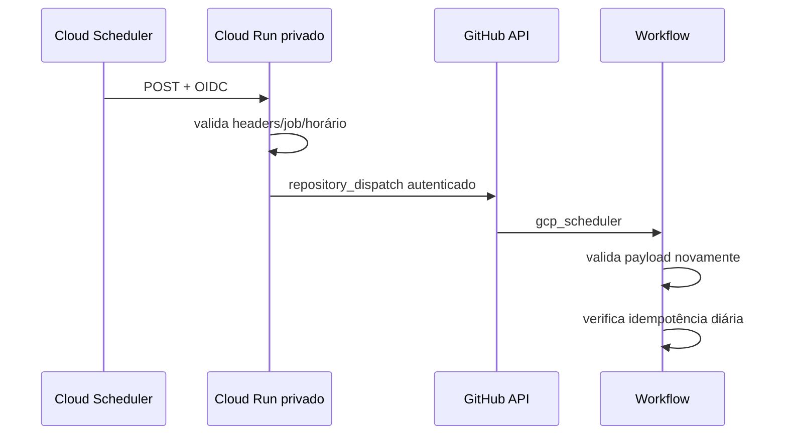
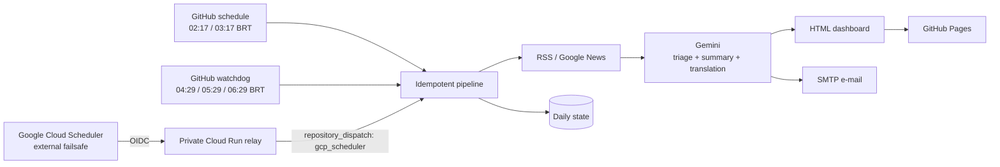

# 🌎 Monitoramento Mídia Internacional | Global Media Monitoring

[](https://github.com/thalesandradepereira/monitoramento-internacional/actions/workflows/ci.yml)


> **Versão / Version:** 1.1.3<br>
> **Fuso operacional / Operational timezone:** `America/Sao_Paulo`<br>
> **Objetivo / Purpose:** monitoramento diário bilíngue, dashboard, e-mail e integração social com múltiplas camadas de contingência.

---

## 🇧🇷 Português do Brasil

### Visão executiva

O **Monitoramento Mídia Internacional** é um pipeline automatizado que coleta notícias internacionais, filtra e deduplica conteúdo, usa Google Gemini para triagem e síntese editorial, produz versões em **PT-BR** e **EN-US**, gera um dashboard HTML diário e envia mensagens individualizadas aos destinatários ativos mantidos fora do GitHub.

O projeto foi desenhado para operar com **fail-closed**, **idempotência diária** e **múltiplos relógios independentes**. Uma execução de contingência pode acontecer várias vezes no mesmo dia sem reenviar conteúdo quando o estado já está concluído.

### Acessos rápidos

| Recurso | Endereço |
|---|---|
| Dashboard de hoje | https://thalesandradepereira.github.io/monitoramento-internacional/hoje |
| Arquivo histórico | https://thalesandradepereira.github.io/monitoramento-internacional/ |
| Analytics operacional | https://thalesandradepereira.github.io/monitoramento-internacional/analytics.html |
| Workflow principal | `.github/workflows/monitoramento.yml` |
| Watchdog GitHub | `.github/workflows/monitoramento-watchdog.yml` |
| Relay Google Cloud | `infra/gcp-scheduler-relay/` |
| Estado diário | `state/daily-executions.json` |

### Arquitetura de produção


```mermaid
flowchart LR
    GH1[GitHub schedule<br/>02:17 / 03:17] --> PIPE
    GH2[GitHub watchdog<br/>04:29 / 05:29 / 06:29] --> PIPE
    GCS[Google Cloud Scheduler<br/>failsafe externo] -->|OIDC| CR[Cloud Run relay privado]
    CR -->|repository_dispatch: gcp_scheduler| PIPE[Pipeline idempotente]
    PIPE --> RSS[RSS / Google News]
    RSS --> AI[Gemini<br/>triagem + síntese + tradução]
    AI --> DASH[Dashboard HTML]
    AI --> MAIL[E-mail SMTP]
    DASH --> PAGES[GitHub Pages]
    PIPE --> STATE[(Estado diário)]
    DASH --> SOCIAL[Wake-up social opcional]
```

A camada Google Cloud foi desenhada para retirar do GitHub o papel de **único relógio**. O Cloud Scheduler não executa o processamento diretamente: ele chama um **Cloud Run relay privado**, autenticado por OIDC, que dispara um `repository_dispatch` validado no GitHub. O pipeline continua responsável por idempotência, segurança e efeitos externos.

### Camadas de agendamento

| Camada | Horários em Brasília | Função |
|---|---:|---|
| GitHub principal | 02:17, 03:17 | execução primária + recuperação |
| Watchdog GitHub independente | 04:29, 05:29, 06:29 | contingência contra perda do workflow principal |
| Google Cloud Scheduler | 06:41, 06:51 | relógio externo depois das contingências GitHub |

> As execuções repetidas são intencionais. O estado diário impede reenvio quando a data já está `completed`.

### Estado da camada Google Cloud

O repositório contém o código completo para:

- relay HTTP mínimo em Node.js 22;
- container Cloud Run;
- validação de `X-CloudScheduler-JobName` e `X-CloudScheduler-ScheduleTime`;
- dispatch separado para mídia e publisher;
- autenticação OIDC Scheduler → Cloud Run;
- token GitHub armazenado em Secret Manager;
- provisionamento idempotente em `infra/gcp-scheduler-relay/deploy.sh`;
- testes unitários do relay e do receptor `gcp_scheduler`.

A ativação dos recursos cloud exige uma identidade Google Cloud com permissões administrativas no projeto de destino e uma credencial GitHub fine-grained autorizada nos dois repositórios. Nenhuma dessas credenciais é armazenada neste repositório.

### Fluxo diário

1. Um dos relógios inicia o workflow.
2. O pipeline sincroniza `main` e verifica o estado persistido.
3. Se o dia já estiver concluído, encerra sem efeitos externos.
4. A lista de destinatários é carregada do Cloudflare D1 por endpoint privado.
5. O sistema registra `in_progress` antes dos efeitos irreversíveis.
6. RSS é coletado, filtrado por janela temporal e deduplicado.
7. Gemini executa triagem, síntese e tradução.
8. O dashboard e os e-mails são renderizados.
9. Em execução real, o dashboard é persistido em `docs/` e os e-mails são enviados.
10. O estado final é gravado e versionado.
11. GitHub Pages publica o dashboard e atualiza `/hoje`.
12. A integração social pode emitir um wake-up opcional para o publisher.

### IA e cobertura editorial

A cobertura padrão inclui Brasil, Estados Unidos, França, Reino Unido, Espanha, Alemanha, Japão, China, Índia e Portugal. As fontes são pesquisas RSS localizadas do Google News e podem variar conforme disponibilidade e indexação.

| Etapa | Modelo padrão | Papel |
|---|---|---|
| Triagem | `gemini-3.5-flash-lite` | seleção em volume |
| Síntese | `gemini-3.6-flash` | decisão editorial por país |
| Tradução | `gemini-3.5-flash-lite` | equivalência EN-US |

As chamadas usam JSON estruturado, validação local por schema, `store=false`, pacing preventivo e retentativas somente para falhas transitórias.

### Dashboard e GitHub Pages

Cada execução real bem-sucedida cria:

```text
docs/Dashboard-Monitoramento-DD-MM-AAAA.html
```

O alias `docs/hoje/index.html` aponta para a edição corrente, com cache desabilitado. O HTML usa CSP com nonce, serialização segura e validações para links externos.

### Destinatários e privacidade

Os destinatários de produção ficam no **Cloudflare D1**, não no GitHub. O endpoint privado exige Bearer token e o pipeline é fail-closed: se a fonte D1 não puder ser carregada ou validada, a execução real para antes do envio.

Controles principais:

- e-mails mascarados em logs;
- descadastro assinado por HMAC;
- secrets somente em GitHub Actions / Worker / Google Secret Manager;
- sem fallback automático para arquivo público de destinatários;
- `dry_run=true` por padrão em execução manual;
- idempotência por data e fuso;
- `concurrency` compartilhada entre principal e watchdog;
- dispatch externo validado por origem, target, job, horário e frescor.

### Hardening de segurança da v1.1.1

A auditoria final identificou um servidor Express legado que ainda aceitava inscrições e gravava e-mails em `recipients.txt`. Esse caminho foi desativado como fonte de dados: o gateway agora apenas redireciona/delega para o Worker oficial, que persiste destinatários em D1. O fallback do Worker que escrevia PII no GitHub também foi removido, e `recipients.txt` não faz mais parte do HEAD.

Outros reforços:

- D1 é a fonte padrão de destinatários;
- o gateway Express não reflete input do usuário em HTML;
- a CSP do dashboard usa nonce também para estilos, sem `style-src 'unsafe-inline'`;
- o workflow auxiliar de verificação D1 usa Actions fixadas por SHA;
- testes específicos cobrem o comportamento do gateway legado.

**Risco residual conhecido:** o formulário público ainda não implementa double opt-in/Turnstile. Isso é uma melhoria de produto/antiabuso recomendada para uma próxima versão, pois exige fluxo de confirmação e configuração adicional de infraestrutura.

### Concorrência entre Media e Social Publisher — v1.1.3

A versão 1.1.3 corrige uma condição de corrida observada em 28/08/2026: enquanto o pipeline de mídia processava e enviava o relatório, o Social Publisher publicou a imagem do Story no mesmo repositório, avançando a `main`. O push final do dashboard/estado foi então rejeitado como `non-fast-forward`.

A persistência agora detecta especificamente esse tipo de rejeição, executa `git pull --rebase origin main` e repete o push com limite de quatro tentativas. Erros de autenticação ou permissão continuam falhando imediatamente.

### Higienização de histórico — v1.1.2

A versão 1.1.2 conclui a higienização do histórico público do Git sem alterar os artefatos publicados em `docs/`.

Controles aplicados:

- histórico da `main` reescrito para remover PII legada de destinatários;
- branches antigas removidas após validação e ausência de PRs abertos;
- releases `v1.0.0`, `v1.1.0` e `v1.1.1` preservadas com tags sanitizadas;
- `recipients.txt` não existe mais na árvore atual nem nas tags reconstruídas;
- os 88 artefatos atuais de `docs/` foram preservados byte a byte;
- a página histórica de 24/08/2026 e o alias `/hoje` foram validados no GitHub Pages;
- os workflows temporários usados na higienização foram removidos após a conclusão.

A limpeza de referências internas/caches mantidos pelo próprio GitHub pode depender de suporte da plataforma e não altera a operação diária do projeto.

### Segurança da camada Google Cloud


```mermaid
sequenceDiagram
    participant S as Cloud Scheduler
    participant R as Cloud Run privado
    participant G as GitHub API
    participant W as Workflow
    S->>R: POST + OIDC
    R->>R: valida headers/job/horário
    R->>G: repository_dispatch autenticado
    G->>W: gcp_scheduler
    W->>W: valida payload novamente
    W->>W: verifica idempotência diária
```

O relay não recebe destinatários, credenciais SMTP, chaves Gemini ou token Instagram. Sua única função é transformar um relógio Google em um evento GitHub autenticado.

### Postura de custo

A arquitetura proposta usa **2 jobs do Cloud Scheduler**. O Google oferece atualmente até **3 jobs sem custo por mês por conta de faturamento**. O relay utiliza Cloud Run com `min-instances=0` e volume de apenas algumas requisições por dia; o GitHub token utiliza uma única versão do Secret Manager. O custo real continua dependente do uso agregado da conta e das políticas vigentes do Google Cloud.

### Operação e diagnóstico

| Verificação | Resultado esperado |
|---|---|
| `state/daily-executions.json` | registro `completed` para a data |
| `docs/Dashboard-Monitoramento-DD-MM-AAAA.html` | arquivo presente |
| `/hoje` | aponta para a data corrente |
| Logs de envio | `failed=0` |
| CI | verde |
| Watchdog | encerra sem duplicar quando o dia já está concluído |
| GCP dispatch | aceito somente se job, target e horário forem válidos |

Em caso de incidente, consulte primeiro o estado persistido antes de reexecutar qualquer rotina real.

### Estrutura do repositório

| Caminho | Responsabilidade |
|---|---|
| `src/run.ts` | orquestração do pipeline |
| `src/fetchNews.ts` | RSS, janela temporal e deduplicação |
| `src/summarize.ts` | triagem e síntese |
| `src/translate.ts` | tradução EN-US |
| `src/geminiHelper.ts` | chamadas Gemini, schema, pacing e retry |
| `src/dashboard.ts` | dashboard HTML |
| `src/todayAlias.ts` | alias seguro `/hoje` |
| `src/email.ts` | e-mail SMTP |
| `src/recipients.ts` | fonte privada de destinatários |
| `src/dailyExecution.ts` | idempotência e estado |
| `scripts/validate-gcp-scheduler-dispatch.mjs` | validação do failsafe externo |
| `infra/gcp-scheduler-relay/` | Cloud Run relay + provisionamento |
| `worker/` | inscrição, descadastro e API D1 |
| `tests/` | testes unitários, integração e regressão |

### Desenvolvimento local

```bash
git clone https://github.com/thalesandradepereira/monitoramento-internacional.git
cd monitoramento-internacional
npm ci
npm test
npx tsc --noEmit
```

Dry run seguro:

```bash
DRY_RUN=true EXECUTION_MODE=manual npm run once
```

### Política de release

O projeto segue SemVer:

- `PATCH`: correção sem nova capacidade;
- `MINOR`: nova capacidade compatível;
- `MAJOR`: mudança incompatível.

A versão 1.1.2 preserva os hardenings da 1.1.1 e conclui a higienização do histórico público, mantendo integralmente os artefatos publicados e as releases funcionais.

---

## 🇺🇸 English

### Executive overview

**Global Media Monitoring** is an automated pipeline that collects international news, filters and deduplicates content, uses Google Gemini for editorial triage and summarization, produces **PT-BR** and **EN-US** output, generates a daily HTML dashboard, and sends individualized e-mails to active recipients stored outside GitHub.

The system is designed around **fail-closed behavior**, **daily idempotency**, and **multiple independent clocks**. Recovery attempts can run more than once without resending content after the operational date has already reached `completed`.

### Quick links

| Resource | Address |
|---|---|
| Today's dashboard | https://thalesandradepereira.github.io/monitoramento-internacional/hoje |
| Dashboard archive | https://thalesandradepereira.github.io/monitoramento-internacional/ |
| Operational analytics | https://thalesandradepereira.github.io/monitoramento-internacional/analytics.html |
| Main workflow | `.github/workflows/monitoramento.yml` |
| GitHub watchdog | `.github/workflows/monitoramento-watchdog.yml` |
| Google Cloud relay | `infra/gcp-scheduler-relay/` |
| Daily state | `state/daily-executions.json` |

### Production architecture


```mermaid
flowchart LR
    GH1[GitHub schedule<br/>02:17 / 03:17 BRT] --> PIPE
    GH2[GitHub watchdog<br/>04:29 / 05:29 / 06:29 BRT] --> PIPE
    GCS[Google Cloud Scheduler<br/>external failsafe] -->|OIDC| CR[Private Cloud Run relay]
    CR -->|repository_dispatch: gcp_scheduler| PIPE[Idempotent pipeline]
    PIPE --> RSS[RSS / Google News]
    RSS --> AI[Gemini<br/>triage + summary + translation]
    AI --> DASH[HTML dashboard]
    AI --> MAIL[SMTP e-mail]
    DASH --> PAGES[GitHub Pages]
    PIPE --> STATE[(Daily state)]
```

The Google Cloud layer removes GitHub as the **single scheduling clock**. Cloud Scheduler does not execute application logic itself. It calls a private Cloud Run relay, authenticated with OIDC, and the relay sends a validated GitHub `repository_dispatch`.

### Scheduling layers

| Layer | Brasília time | Purpose |
|---|---:|---|
| Primary GitHub workflow | 02:17, 03:17 | primary execution and recovery |
| Independent GitHub watchdog | 04:29, 05:29, 06:29 | recovery from a missed primary schedule |
| Google Cloud Scheduler | 06:41, 06:51 | external clock after GitHub fallbacks |

Duplicate wake-ups are safe because the application checks persistent daily state before producing side effects.

### Google Cloud layer

The repository includes:

- a minimal Node.js 22 HTTP relay;
- a Cloud Run container;
- Scheduler header and freshness validation;
- separate media and publisher targets;
- OIDC Scheduler → Cloud Run authentication design;
- Secret Manager integration for the GitHub dispatch credential;
- idempotent provisioning logic in `infra/gcp-scheduler-relay/deploy.sh`;
- unit tests for both relay and GitHub receiver.

Live provisioning requires a Google Cloud principal with sufficient permissions and a restricted GitHub fine-grained credential. Credentials must never be committed to this repository.

### v1.1.1 security hardening

The final audit found a legacy Express subscription server that could still accept addresses and write them to `recipients.txt`. That path is no longer an authoritative data store: the gateway now redirects/delegates to the official Worker, which persists recipients in D1. The Worker fallback that could write recipient PII through the GitHub API was removed, and `recipients.txt` is no longer present in HEAD.

Additional hardening:

- D1 is the default recipient source;
- the Express gateway no longer reflects user input into HTML;
- dashboard CSP uses a nonce for styles and no longer allows `style-src 'unsafe-inline'`;
- the auxiliary D1 verification workflow uses immutable Action SHAs;
- dedicated tests cover the legacy gateway behavior.

**Known residual risk:** the public subscription form does not yet implement double opt-in/Turnstile. That is recommended as a future anti-abuse/product enhancement because it requires a confirmation flow and additional infrastructure configuration.

### History sanitization — v1.1.2

Version 1.1.2 completes the public Git history sanitization without changing the published `docs/` artifacts.

Controls applied:

- the public `main` history was rewritten to remove legacy recipient PII;
- stale branches were removed after validation and confirmation that no pull requests were open;
- releases `v1.0.0`, `v1.1.0`, and `v1.1.1` remain available through sanitized tags;
- `recipients.txt` is absent from the current tree and reconstructed release tags;
- all 88 current `docs/` artifacts were preserved byte-for-byte;
- the 24/08/2026 historical page and `/hoje` were validated through GitHub Pages;
- one-time sanitization workflows were removed after completion.

Server-managed pull-request refs/caches may still require GitHub Support for complete dereferencing; this does not affect the daily production pipeline.

### Reliability and security

The production pipeline:

- synchronizes `main` before a real run;
- persists `in_progress` before irreversible effects;
- blocks duplicates by operational date and timezone;
- fails closed when private recipient data cannot be validated;
- masks recipient addresses in logs;
- validates external dispatch source, target, job name, schedule time and freshness;
- uses GitHub Actions pinned to immutable SHAs;
- runs security audit, tests, TypeScript checks, YAML validation and relay tests in CI.

### Cost posture

The design uses two Cloud Scheduler jobs, below Google's current allowance of three free jobs per billing account per month. Cloud Run is configured for zero minimum instances and extremely low traffic, while Secret Manager requires only one active secret version. Billing can still vary with account-wide usage and future pricing changes.

### Repository map

| Path | Responsibility |
|---|---|
| `src/run.ts` | pipeline orchestration |
| `src/fetchNews.ts` | RSS collection and deduplication |
| `src/summarize.ts` | editorial triage and summaries |
| `src/translate.ts` | EN-US translation |
| `src/geminiHelper.ts` | Gemini API, schemas, pacing and retries |
| `src/dashboard.ts` | HTML dashboard |
| `src/todayAlias.ts` | safe `/hoje` alias |
| `src/email.ts` | SMTP delivery |
| `src/recipients.ts` | private recipient source |
| `src/dailyExecution.ts` | idempotency and state |
| `scripts/validate-gcp-scheduler-dispatch.mjs` | external clock guard |
| `infra/gcp-scheduler-relay/` | Cloud Run relay and provisioning |
| `worker/` | D1 subscription/unsubscribe API |
| `tests/` | unit, integration and regression tests |

### Local development

```bash
git clone https://github.com/thalesandradepereira/monitoramento-internacional.git
cd monitoramento-internacional
npm ci
npm test
npx tsc --noEmit
```

Safe dry run:

```bash
DRY_RUN=true EXECUTION_MODE=manual npm run once
```

### Release policy

This repository follows Semantic Versioning. Version **1.1.1** preserves the Google Cloud Scheduler control plane introduced in 1.1.0 and adds security/privacy hardening for the legacy web gateway, recipient storage, and dashboard CSP.

---

**Made by TAP**
