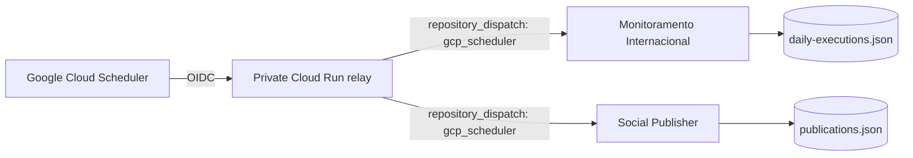

# Google Cloud Scheduler failsafe

This directory contains the external scheduling control plane shared by:

- `thalesandradepereira/monitoramento-internacional`
- `thalesandradepereira/monitoramento-social-publisher`

Its purpose is to remove GitHub Actions Scheduler as the only production clock. Google Cloud Scheduler calls a **private Cloud Run relay** using OIDC. The relay validates the Scheduler request and forwards an authenticated GitHub `repository_dispatch: gcp_scheduler`. Each receiving workflow validates the event again and applies its own persistent idempotency rules before any external side effect.

## Production topology



## Production jobs

| Job | Brasília schedule | Purpose |
|---|---:|---|
| `tap-monitoramento-media-failsafe` | 06:41 and 06:51 | Runs after the GitHub media watchdogs |
| `tap-instagram-publisher-failsafe` | 05:41 and 05:51 | Runs after the GitHub publisher watchdogs |

The repeated wake-ups are intentional. The media and publisher applications use authoritative daily state and shared concurrency controls to prevent duplicate effects.

## Activation status

The repository is **deployment-ready**. The relay, Docker image, receiving guards, IAM model, Secret Manager integration, Scheduler definitions and idempotent provisioning script are versioned and covered by CI.

Live Google Cloud resources must still be provisioned from an authenticated Google Cloud principal. Do not describe the external clock as active until both Scheduler jobs exist in the target project and at least one validated `repository_dispatch: gcp_scheduler` has been observed.

## Security model

- Cloud Run remains private; anonymous invocation is disabled.
- Cloud Scheduler uses a dedicated OIDC service account with only `roles/run.invoker` on the relay.
- Cloud Run uses a separate runtime service account.
- The GitHub dispatch credential is stored in Secret Manager and never committed or logged.
- The dedicated GitHub token must select **only**:
  - `monitoramento-internacional`
  - `monitoramento-social-publisher`
- The token needs repository permission **Contents: Read and write**, which is required for `repository_dispatch`.
- The provisioning script verifies dispatch permission against both repositories using the non-production event `gcp_connectivity_probe`. Production workflows do not subscribe to that event.
- Relay routes and Cloud Scheduler job names are allow-listed.
- `X-CloudScheduler`, `X-CloudScheduler-JobName` and `X-CloudScheduler-ScheduleTime` are validated.
- GitHub receivers validate source, target, job, current Brasília date and freshness again.
- The relay never receives recipients, SMTP credentials, Gemini credentials or Instagram credentials.
- Old enabled versions of the GitHub dispatch secret are destroyed after a successful relay deployment so only the current version remains active.

## Provisioning requirements

You need:

1. an existing Google Cloud project with billing enabled;
2. an authenticated principal that can enable APIs and manage Cloud Run, Cloud Scheduler, Secret Manager and IAM/service accounts;
3. `gcloud` and `curl`;
4. a dedicated fine-grained GitHub PAT authorized for both repositories with **Contents: Read and write**.

The script intentionally requires `GCP_PROJECT_ID`; it no longer silently defaults to a project name. This prevents accidental deployment into the wrong Google Cloud project.

## One-command activation

From an authenticated Google Cloud Shell or terminal:

```bash
cd infra/gcp-scheduler-relay
export GCP_PROJECT_ID='YOUR_GCP_PROJECT_ID'
read -rsp 'GitHub dispatch token: ' GITHUB_DISPATCH_TOKEN && echo
export GITHUB_DISPATCH_TOKEN
./deploy.sh
unset GITHUB_DISPATCH_TOKEN
```

The deployment is idempotent. Re-running it updates the existing service and Scheduler jobs rather than creating duplicates.

The script performs these gates before reporting success:

1. confirms an active Google Cloud identity;
2. confirms access to the exact `GCP_PROJECT_ID`;
3. checks billing status when the principal can inspect it;
4. validates GitHub `repository_dispatch` permission against both repositories without triggering production workflows;
5. enables required Google APIs;
6. resolves the Google Cloud project number and grants `roles/run.builder` to the Compute Engine default service account used by Cloud Build for source deployments;
7. creates/reuses dedicated runtime and invoker service accounts;
8. creates/reuses the Secret Manager secret and adds the current token version;
9. deploys a private Cloud Run relay with `min-instances=0` and `max-instances=1`; if the newly granted builder IAM is still propagating, only that specific IAM failure is retried;
10. grants the Scheduler invoker only `roles/run.invoker`;
11. creates/updates the two Scheduler jobs;
12. removes superseded active secret versions;
13. describes both jobs as final deployment evidence.

## Safe live verification

First confirm that the authoritative state for the current Brasília date is already `completed` in both repositories. Only then run:

```bash
gcloud scheduler jobs run tap-monitoramento-media-failsafe \
  --project "$GCP_PROJECT_ID" \
  --location us-central1

gcloud scheduler jobs run tap-instagram-publisher-failsafe \
  --project "$GCP_PROJECT_ID" \
  --location us-central1
```

Expected result:

- GitHub receives `repository_dispatch: gcp_scheduler`;
- each receiver validates the relay payload;
- idempotency detects that the day is already complete;
- no duplicate e-mail and no duplicate Instagram Story are produced.

## Cost posture — verified 2026-08-29

The design intentionally stays inside the expected free usage envelope for this workload:

- Cloud Scheduler: **2 jobs**; Google currently includes **3 jobs per billing account per month** at no charge.
- Secret Manager: the script keeps one active token version; Google currently includes up to **6 active secret versions** and **10,000 access operations/month** at no charge.
- Cloud Run: `min-instances=0` and a few short requests per day; the service is expected to remain far below the Cloud Run free-tier compute/request allowances under normal use.

Free-tier limits are aggregated by billing account and can change. Always check the current official pricing before assuming a zero bill:

- https://cloud.google.com/scheduler/pricing
- https://cloud.google.com/run/pricing
- https://cloud.google.com/secret-manager/pricing

## Failure handling

If provisioning stops, do not partially reproduce commands by hand until the failing gate is understood. The script is idempotent and is intended to be rerun after correcting the root cause.

Common failure classes:

| Failure | Meaning |
|---|---|
| no active Google identity | authenticate with `gcloud auth login` or use Cloud Shell |
| project inaccessible | wrong `GCP_PROJECT_ID` or insufficient IAM |
| billing disabled | attach an enabled billing account |
| GitHub probe != HTTP 204 | token does not have repository-dispatch permission on one or both repositories |
| Cloud Run source build says default service account lacks IAM | the script grants `roles/run.builder` to `PROJECT_NUMBER-compute@developer.gserviceaccount.com`; rerun the current script after pulling `main` |
| Cloud Run deploy failure for another reason | inspect Cloud Build/Run error before retry; the script refuses blind retries for unrelated failures |
| Scheduler OIDC 401/403 | inspect invoker service account and `roles/run.invoker` binding |
| receiver rejects dispatch | inspect target/job/schedule freshness validation |

## Files

| Path | Purpose |
|---|---|
| `deploy.sh` | idempotent production provisioning |
| `src/server.mjs` | private Scheduler → GitHub relay |
| `Dockerfile` | Cloud Run container |
| `package.json` | relay tests/runtime metadata |

No Google Cloud credential or GitHub token belongs in this repository.
