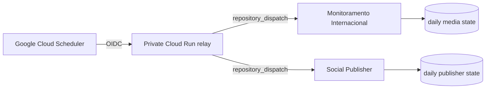

# Google Cloud Scheduler failsafe

This directory contains the external scheduling control plane shared by:

- `thalesandradepereira/monitoramento-internacional`
- `thalesandradepereira/monitoramento-social-publisher`

The design separates the clock from GitHub Actions. Google Cloud Scheduler calls a private Cloud Run relay with OIDC. The relay forwards an authenticated GitHub `repository_dispatch` event. Each receiving workflow validates the event again and keeps its own persistent idempotency rules.

## Production topology

## Planned jobs

| Job | Brasília | Purpose |
|---|---:|---|
| `tap-monitoramento-media-failsafe` | 06:41 and 06:51 | Runs after the GitHub media watchdogs |
| `tap-instagram-publisher-failsafe` | 05:41 and 05:51 | Runs after the GitHub publisher watchdogs |

The repeated executions are intentional. Both applications enforce daily idempotency.

## Security model

- Cloud Run must remain private.
- Cloud Scheduler authenticates to Cloud Run with a dedicated OIDC service account.
- The relay needs only one GitHub dispatch credential at runtime.
- The GitHub credential must be stored in Secret Manager and never committed or logged.
- Relay routes and Cloud Scheduler job names are allow-listed.
- `X-CloudScheduler-JobName` and `X-CloudScheduler-ScheduleTime` are validated.
- GitHub workflows validate source, target, current Brasília date and freshness again.
- The relay never sends e-mail and never calls the Meta API directly.

## Cost posture

The design uses two Cloud Scheduler jobs. Google currently provides three Cloud Scheduler jobs per billing account per month at no charge. The relay is designed for Cloud Run with min instances 0 and very low request volume; one Secret Manager version is sufficient. Actual billing still depends on account-wide usage and Google pricing.

## Activation requirements

Provisioning requires a Google Cloud principal with permission to create IAM/service-account bindings, Cloud Run, Secret Manager and Cloud Scheduler resources in the target project, plus a GitHub credential authorized only for the two repository-dispatch endpoints.

No Google Cloud credential or GitHub token belongs in this repository.
